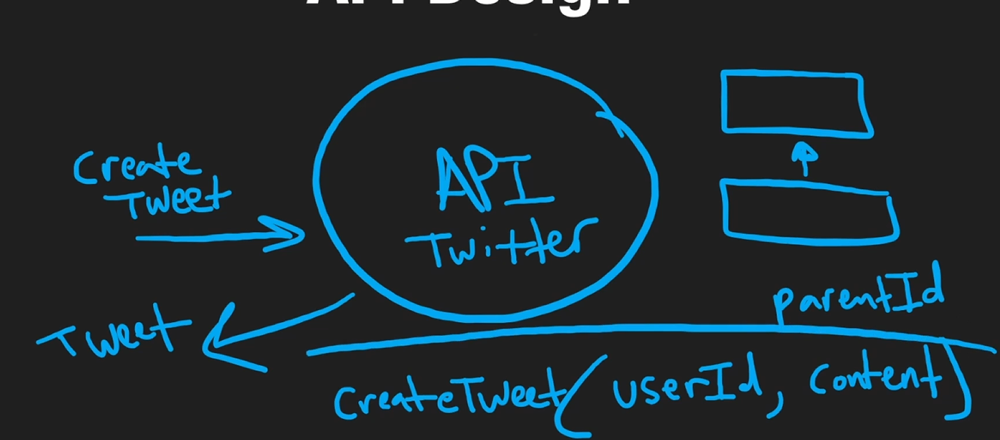

# What is API Design

API design is the process of planning and defining the endpoints, request/response formats, conventions, and protocols an API will use. The goal is to provide a well-structured, intuitive, and useful interface for interacting with a software application.

[[API Paradigms]] allow us to control the interface of our API's, they are the API contract. The design is the structuring of the surface level interactions to communicate with the application; what actions you have to take to access the resources and perform CRUD operations on the resources and entities.

**Twitter API** -> Create  -> Tweet `[POST]`

`Create` could be a resource and a `tweet` is an entity, in other words the thing being created by the resource; both are nouns or things. The verb is the request type `POST`

In summary, the important thing of API design is we do not care about the implementation of the actual API, in terms of the functions run in the backend. We only care about the surface area of how we are interacting with the API as users. It's similar to creating functions, we don't care about the implementation of that function, but we care about the parameters that go into the function and what we get in response.

# Why is API Design Important?

With Public Facing API's, we cannot change things easily once shipped. Say for creating a tweet:

`POST https://api.twitter.com/v1.0/tweet` where the body contains:
```json
createTweet {
	userId: "1",
	content: "tweet message"
}
```
If this is the documented and defined structure of the API call to create a tweet; this can be seen as a contract between the client and the server that defines how this sort of communication is supposed to go from now and henceforth.

If you change the parameters creating a tweet accepts, **and add a parameter that you define an non-optional in your actual implementation**, and therefore changing the structure, this would break all clients that rely on the previous version of the API

Adding an optional parameter allows you to add new features, but also enable backwards compatibility with the people using the old API version.


## Versioning
Of course, there are times we need to introduce new parameters to our API and this is where versioning comes in to enable backwards compatibility.

We can add the version to the path to have multiple versions of our co-existing at the same time, as we slowly push people to update towards the newer version and deprecate the older one.


## Definitions

### URL and Query Parameters

URL parameters and query parameters are both parts of a URL that can be used to send data to the server, but they are used in different ways:

- **URL Parameters**: Also known as path parameters or path variables, these are embedded in the URL path. They are typically used to identify a specific resource or a group of resources. For example, in the URL `https://example.com/users/123`, `123` is a URL parameter that likely identifies a specific user.
- **Query Parameters**: These are appended to the end of the URL after a `?` character and are usually used to sort/filter resources or return specific attributes. They can also be used for tracking purposes in analytics. For example, in the URL `https://example.com/users?sort=asc`, `sort=asc` is a query parameter that might be used to sort the users in ascending order.

Parameters can be set to optional or required within the URL for a given resource, typically optional parameters have a default value assigned within the backend.
### Posting a Tweet
`POST https://api.twitter.com/v1.0/tweet'

We can define what parts of the tweet object are created client side and server side by what makes the most sense.
1. A tweetId for example is unique to every tweet and is handled server-side because the client does not know what Id's are available or how to create them.
2. createdAt, can be handled client or server-side but for efficiency purposes it just makes sense to handle server-side; also it is a better idea to not have the user define when something was created client-side especially when the actual tweet is created serverside.
3. The userId and and content are created client-side to identify the user sending the tweet, as well as the actual tweet body.

| Tweet |  |
| ---- | ---- |
| userId: | string |
| tweetId: | string |
| content: | string |
| createdAt: | date |
| likes: | int |
### Getting a Tweet
`GET https://api.twitter.com/v1.0/tweet/:Id`

We have an additional parameter for our URL, the `:Id` is not a resource but a parameter at the tweet resource when using the `GET` request.

We could also have it be a `DELETE` request and as long as the functionality is done in the back-end for a function that changes if the request is a delete at the tweet route, with a valid `:Id` parameter, it will delete the tweet.

### Pagination
When you are listing a large amount of data, say you wanted to get every tweet a user has and they had 100,000's
We have to create a new resource/endpoint to list all the tweets; as the original endpoint already had the defined functionality to get a single tweet. (You could program the functionality into the same resource but it's better to separate functionality)
`GET https://api.twitter.com/v1.0/users/:Id/tweets?Limit=10`
Typically `:id`'s or URL Parameters follow the resource they are applied to.

You wouldn't want to send them all at once or you might crash the users browser; the best way to handle this is to pass in a `Limit=10` parameter within the path.

If we wanted to see 10 more tweets, we could go up 10 tweets with an offset. An offset basically tells the server where to start the list.
`GET https://api.twitter.com/v1.0/users/:Id/tweets?Limit=10&Offset=10`

Typically instead of using offset, in the real world we use a **pagination_token**, which is returned with the first request and can be used to move forward or backward relevant to the current token, when we pass it in to the next request.

> [!NOTE]
>
> **We are listing these Parameters in the URL itself as URL Parameters & Query Parameters because GET requests do not have a body like the other HTTP Operations**


> [!NOTE] Title
> You typically do not want to create or mutate entities with a GET request as they are supposed to be idempotent, and ASSUMED to be idempotent. Imagine we got a tweet once, if we got it again it should return the same tweet. It shouldn't modify things or add side-effects in a way where the tweetId changes.
>
> This is important for caching, because by default GET requests are cached. If a GET request changes things, your version of the entity in cache could be incorrect.

# Design Practice

Key considerations in API design include:

1. **Consistency**: The API should follow consistent naming conventions and response formats across all endpoints.
2. **Usability**: The API should be easy to use and understand. This often involves providing clear, comprehensive documentation.
3. **Security**: The API should implement appropriate authentication and authorization mechanisms to protect sensitive data.
4. **Versioning**: The API should have a strategy for handling changes and updates without breaking existing clients.
5. **Performance**: The API should be designed to handle requests efficiently and minimize latency.
