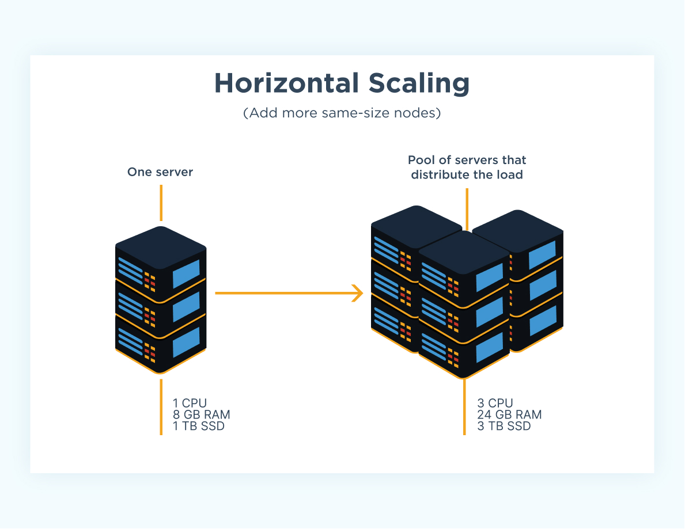
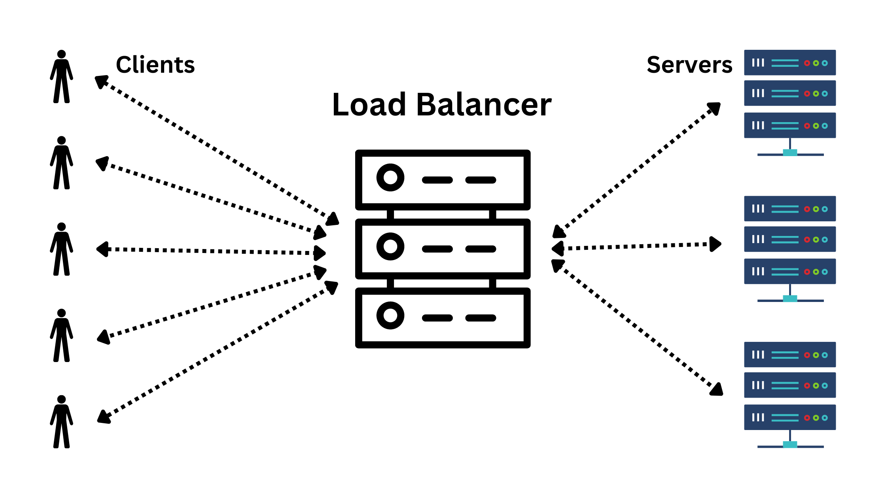
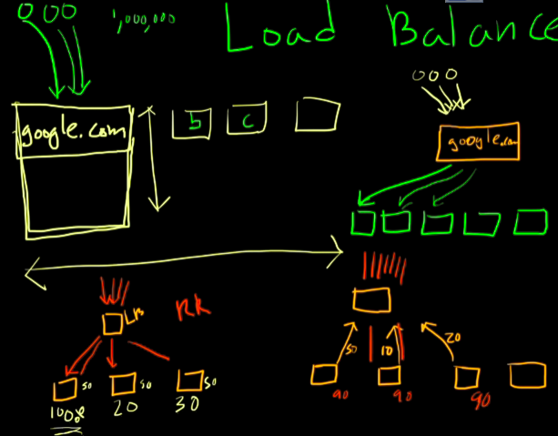

# LOAD BALANCERS

Say we have a server, a single box, for some product, i.e. google.com; and we have users querying our server for data. We respond and give them that data and everything is fine, but what happens when two more people query the same server, or twenty more or two thousand at once. A single server has to handle multiple requests and will slow down, and maybe eventually halt.

We have multiple options to use as solutions, one is **Vertical Scaling** ([[Vertical vs Horizontal Scaling]]). 

### Vertical Scaling
We can increase the amount of compute. We are making the box bigger, so we can fit in and handle more requests at once. We are still serving requests via one machine, but that machine is stronger now; it can lift more weights. (Doubling the number of cores, adding more ram etc.)

If we are buying more compute we should be able to handle more traffic. However this is extremely expensive.

==It turns out that the cost to double the amount of CPU's in a single machine, is typically more expensive than just buying a second identical copy of the same machine.==

Another problem is that, machines can only get so big; there is a modern limit on the amount of compute available for a given problem outside of cost.

### Horizontal Scaling
What there is not a limit on however, is how many additional servers you can buy. This is horizontal scaling.

Generally speaking, scaling horizontally is the better solution. It is more cost effective, however it is more complex as you have to implement the load balancing. (There are however cloud solutions to configure this automatically for you).

When someone requests some data from google.com, they are requesting it from the main server, they do not have any way to reach out to the other machines. It doesn't make sense to have your users manually route your requests to the available servers, and this is where load balancers come in.

## WHAT IS A LOAD BALANCER?

A load balancer behaves as advertised: it balances a load of network traffic.

Think of a _huge_ website like `Google.com`. There's _no way_ that a single server (literally a single computer) could handle all of the Google searches for the entire world. Google uses load balancers to route requests to different servers.

A load balancer itself does not do any real work, it is a forwarder of work. You put all your application servers behind the load balancer, and all your clients sit in front of it and they now make requests to the load balancer.

Now whenever a request comes into the load balancer, it has no idea how to handle it; it has no logic for the particular request. What it does know how to do however, is route that traffic back to one of the application servers that has free resources, receive the response and send it back to the client.

==**The load balancers is pretty much responsible for splitting traffic up and allowing horizontal scaling.**==

## HOW DOES A LOAD BALANCER WORK?

A central server, called the "load balancer", receives traffic from users (aka clients), then routes those raw requests to different back-end application servers. In the case of Google, this splits the world's traffic across potentially many different thousands of computers.

## HOW DOES IT "BALANCE" THE TRAFFIC?

A _good_ load balancer sends more traffic to servers that have unused resources (CPU and memory). The goal is to "balance the load" evenly. We don't want any individual server to fail due to too much traffic. There are many strategies that load balancers use, but a simple strategy is the "round robin". **==Requests are simply routed one after the other to different back-end servers.==**

### EXAMPLE OF "ROUND ROBIN" LOAD BALANCING

- Request 1 -> Server 1
- Request 2 -> Server 2
- Request 3 -> Server 3
- Request 4 -> Server 1
- Request 5 -> Server 2
- ...

This works okay, especially on a smaller scale when we only have 2 or 3 servers and all the requests are roughly the same size.

However, imagine our servers are not just web servers, serving HTML, CSS and JavaScript files; but REST API servers serving resources back to a browser. You can imagine a scenario where someone is requesting a ton of data.

It can happen by coincidence that the requests that are going to a particular server, are heavier than the rest. (The delta between the size of the requests differs greatly between the servers). In a round robin scenario, a load balancer is going to keep sending traffic to the server that is maxed out. That is not ideal. 

A good load balancer will try to average out the traffic across the machines. For example, the application servers could communicate back up to the load balancer their current resource usage condition, the load balancer can look at it's options and send the request to the server with the least utilization percentage. This provides a much more event distribution of resource usage.

The utilization could still creep up to an average of 90% across every server however the great thing about load balancers and horizontal scaling is, you can just deploy another server to the fleet and the load balancer is immediately able to distribute the traffic to the free server; lightening the load on the other ones.

**A load balancer...**

- [ ] ... steals network traffic from other servers
- [ ] ... sends all traffic to one server, waits for  it to crash, then moves to the next
- [x] ... forwards network requests to other back-end servers