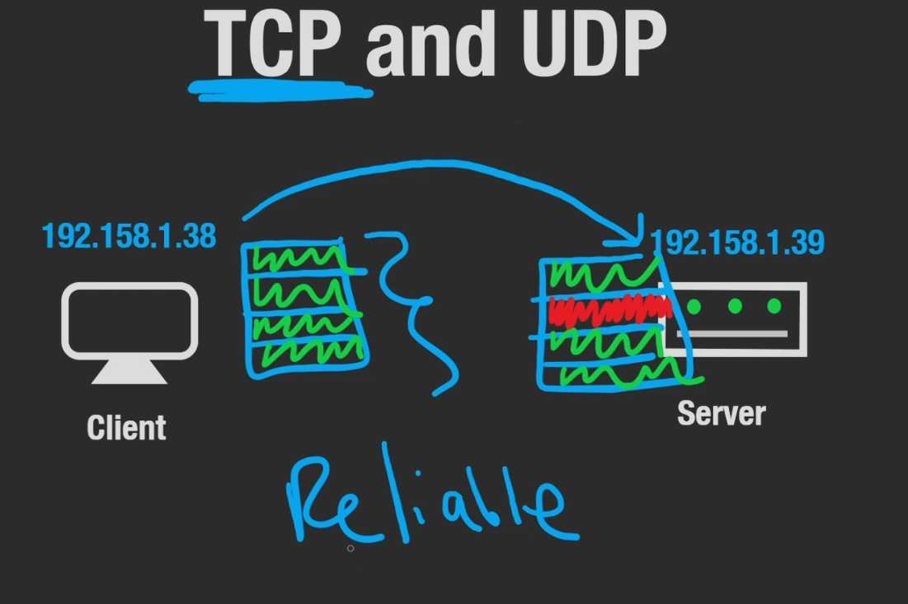
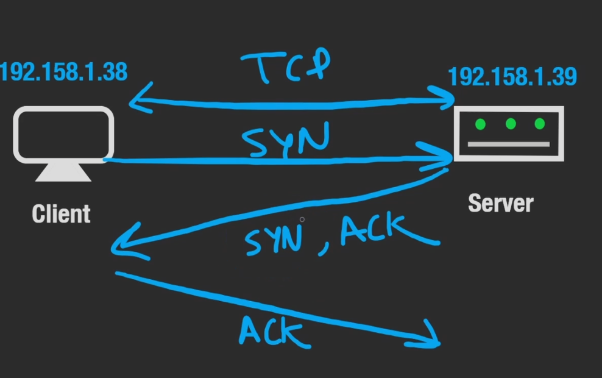
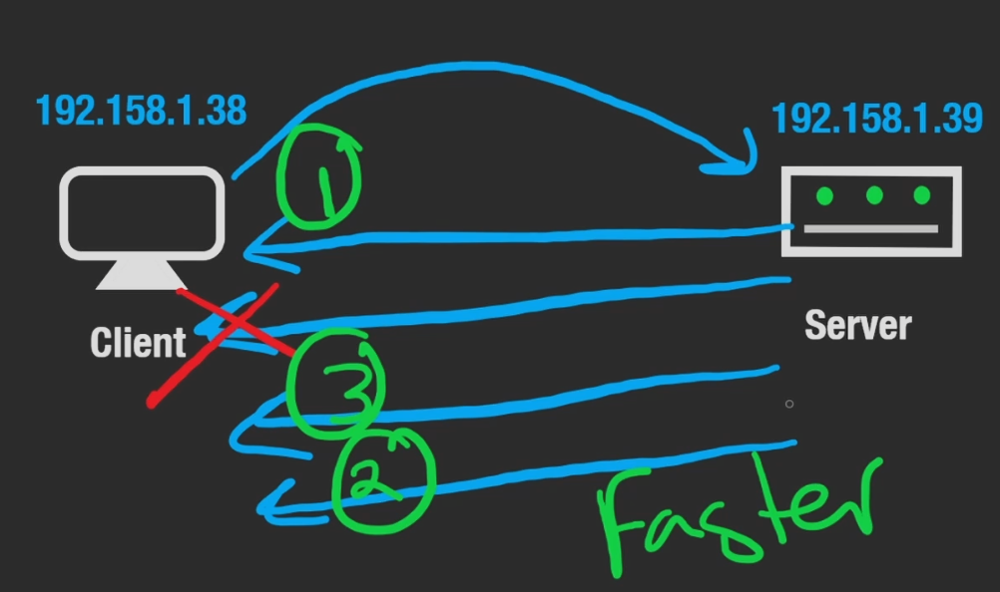

The Internet Protocol Suite, mainly seen to be TCP/IP meaning TCP running with IP. Also includes other protocols like UDP.
# **Transmission Control Protocol**

Sequential order of packets is an inherent property of TCP. It is what is used to reassemble the packets of the split larger file being sent.

TCP is also more reliable; as if some packets of data do not arrive; the server will be implicitly aware and request the missing packets from the client; and those packets and only those packets will be re-sent. This makes TCP light weight and a two-way communication. (*re-transmission of lost packets*)

This happens because TCP establishes a two-way connection between the two machines. Allowing you to send data, back and forth. This two-way connection is established with a 3-way handshake.

This reliability comes at the expense of extra requests. We send a request to the server synchronise, a request back from the server to acknowledge the sync and lastly we send a request back from the client to acknowledge the servers sync.

**TCP has a lot of overhead for the guarantees it offers and has more latency as a result.**

TCP also has a lot of application level protocols that built on top of it for different requests, such as HTTP for web, SMTP for mail and WS for web sockets.
# User Datagram Protocol
The benefit of UDP is that we do not need a handshake; we do not need to establish a connection between the client and the server; so it is faster as it does not have the same overhead as TCP.

A client could request data and the server could immediately begin sending it , however the downside of this is if one of those packets is lost it is lost forever; there is not guarantee the data will arrive and no failsafe to get it back.

There is also no guarantee of order, as there is no implicit definition of which packet is positioned at which index in the original file structure

UDP is most useful in cases where you are streaming packets in real-time. For example, when you are watching something live and there is a break in the connection; you do not want the connection to pick up where it left off, you want it to be as close to real time as possible.

Also UDP is used in [[DNS]]
