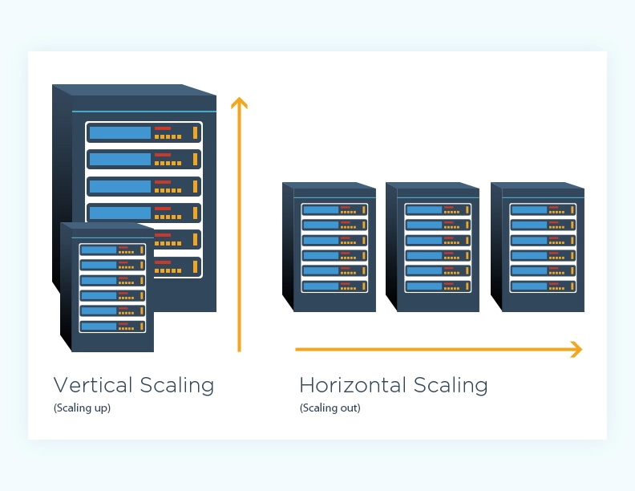
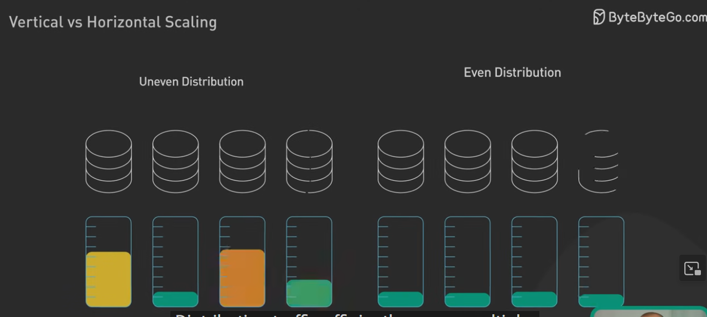

---
references:
  - https://www.youtube.com/watch?v=dvRFHG2-uYs
---
Vertical scaling is genuinely cheaper short-term. However Horizontal Scaling is more cost-effective in the long-term.

Speed is ambiguous. The word 'fast' is ambiguous, what is the speed being compared to? Are we talking about latency? Are we talking about throughput?

Horizontal scaling handles workloads that are unpredictable and bursty; as it is easier to distribute peak demand across multiple servers than a single overloaded node. 

This in turn means horizontal scaling can help you distribute load and improve responsiveness.

There's an upper limit in vertical scaling. There is no upper limit on horizontal scaling beyond price of hardware, power to run it all, and software to take advantage of all the hardware.

- "Scale" means designing a computer system for large loads (like lots of users).
- "Scale vertically" means buying/renting a more powerful computer to handle bigger loads.
- "Scale horizontally" means buying/renting a larger number of separate computers to handle bigger loads.
Usually it's easier _for the developer_ to create software that scales vertically. But it's often more feasible _for the software's operator_ to scale horizontally.

Why is this?

- It's usually simple to buy/rent many times more computers just like the one(s) you already have.
- It's usually impossible to buy/rent a computer with specs many times more powerful than the one(s) you already have (especially in terms of single-core performance).
- 

Horizontal scaling does not improve performance linearly.

Scaling horizontally does however grant better flexibility in terms of adjusting computational capacity to load. For example, e-commerce-type applications may see bursty workloads during peak hours and certain holidays. It's easier to adjust from 3 to 10 instances than to continuously re-boot or pre-emptively scale up a single instance according to the load.

---
Generally, unless your application cannot be distributed, if you can go horizontal, just go horizontal.

Cost-wise, it's the same if you have 2 m4.large or 1 m4.xlarge. However, resources are not limited to only ram and vcpu.

It gives you:

- Redundancy: if one server/app fail, the other still runs and you hopefully have a load balancer upfront that can reroute the traffic waiting for a new instance to come up.
    
- More bandwidth: Network could be your bottleneck rather than system resources and you have more network capabilities with 2 instances rather than one, though it is not stated by AWS that an m4.xlarge hasn't twice the network capability of an m4.large.
    

If your application benefit of more ram, it can makes sense to scale the instance vertically.

If adding another instance makes you have to communicates between the two, then you should also consider to scale vertically because the network traffic will eat away your performance compare to having it on a single instance.

**Cons:**
- Higher upfront costs, sharding your database to distribute the workload can be complex and require significant effort
- It's extremely difficult to set-up and manage a distributed system compared to a monolith, this is especially true for stateful systems (i.e. One's with Databases) due to cacheing and race conditions
- Maintaining data consistency across multiple nodes requires data replication mechanisms as well as verification, which can add additional overhead to the system
- Distributing traffic efficiently across multiple servers requires a robust load-balancing solution, which can add additional software and hardware costs to infrastucture
