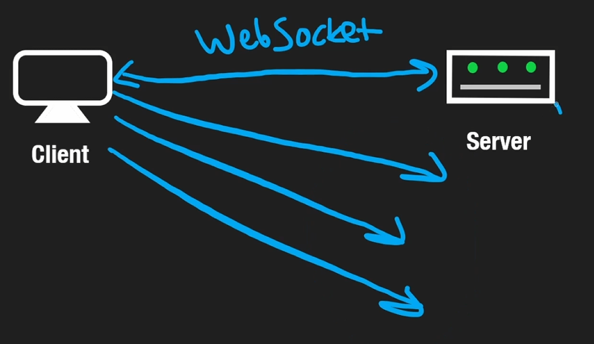
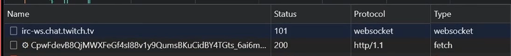

# The Dilemma

What is the problem of HTTP that we are trying to solve with WebSocket's?

Say we have a webchat and want to continue updating the chat to see what messages are being sent. At 12PM we can send a request for the list of messages and at 12:01PM we can send another request to see if there are more messages. These repeated requests are called polling. The rate at which we request a resource is the polling rate.

Deciding the time in which we wait to send another request or the polling rate, can be difficult. 1 minute can be too long to wait to see a new message and while 1 second would work this is inefficient for both the client and the server. They would have to create a new connection every single second.

One solution to this is another protocol entirely -- WebSockets!

# WebSockets

1. We send a HTTP Request to the server, to establish a Websocket handshake.
2. The server responds with a status code of 101, and this means the server has upgraded the connection to a WebSocket connection.
3. After this handshake there is a persistent connection established between the client and the server. They can both communicate without need for a response.
   

This means that every time there is a new message; the server immediately pushes that information to us and we do not have to request it.

This is bi-directional communication(full duplex connection), that HTTP does not do out of the box until HTTP 2.0 where streaming was introduced. (HTTP 2.0 made Websockets obsolete but Websockets are still used)

WebSockets can be seen to be 'websocket' or 'ws' in the networking tab on DevTools.

