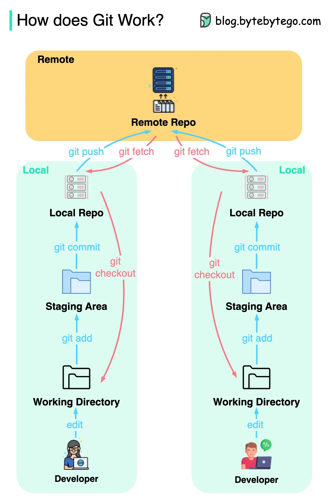
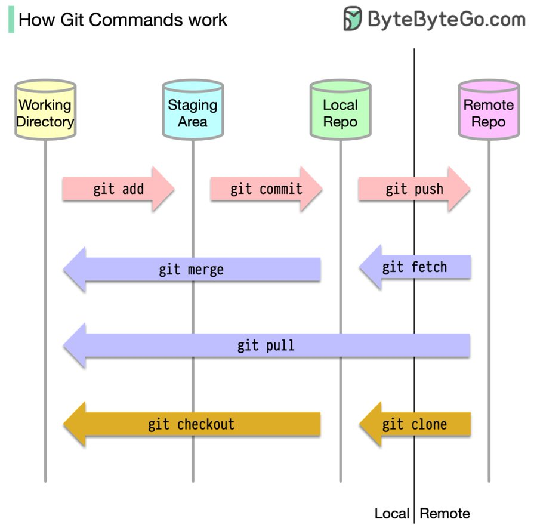
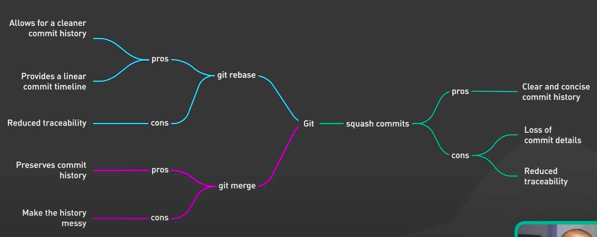

---
sub-topics:
  - "[[Bash]]"
  - "[[gitignore]]"
references:
  - https://youtu.be/0chZFIZLR_0?si=WVdxk0Gm9V0vx7Ca
---




# Install

```bash
sudo apt get install git
sudo apt get install gh # Install Github CLI

gh auth login # authenticate with account - prefer HTTPS

git config --global user.name "Your Name" # Set-up local username and email
git config --global user.email "your-email@example.com"

```

The `--global` option applies these settings to all repositories on your computer. If you want to set the username and email for a specific repository only, navigate to that repository in your command line and run the commands without the `--global` option.

# Four Main Areas of Git

1. **Working Directory**: This is where you're currently working. It's like your desk where you're making changes to your files.

2. **Staging Area (or Index)**: This is where you save changes that you want to commit. It's like a box where you put things you want to keep, or ram.

   - **Adding to the Staging Area**: `git add filename` adds a file to the staging area. It's like putting a file in the box.
   - **Removing from the Staging Area**: `git reset filename` removes a file from the staging area. It's like taking a file out of the box.

3. **Local Repository**: This is where your commits are saved. It's like a storage room where you keep the boxes that you've packed and labelled.

   - **Committing to the Local Repository**: `git commit -m "message"` saves the contents of the staging area as a new commit in the local repository. It's like putting the box in the storage room and labelling it.

4. **Remote Repository**: This is where your commits are shared with others. It's like a warehouse where you and others can store and get boxes.

   - **Pushing to the Remote Repository**: `git push origin branch-name` sends your new commits to the remote repository. It's like sending your boxes to the warehouse.
   - **Pulling from the Remote Repository**: `git pull origin branch-name` gets new commits from the remote repository. It's like getting new boxes from the warehouse.

Remember, each area has a purpose. You work in the Working Directory, save changes in the Staging Area, store commits in the Local Repository, and share commits in the Remote Repository. Understanding these areas can help you use Git more effectively.

# Basics

## Commands

Sure, here's a simplified explanation of these Git commands:

### Git Init

`git init` is like saying, "Let's start a new project." It creates a new Git repository in your current directory.

- **Usage**: `git init`

### Git Clone

`git clone <url>` is like saying, "I want a copy of that project." It makes a copy of a repository from a URL.

- **Usage**: `git clone https://github.com/user/repo.git`

### Git Status

`git status` is like asking, "What's changed?" It shows the status of your project, including changes that are staged, not staged, and untracked.

- **Usage**: `git status`

### Git Add

`git add <file>` is like saying, "I want to keep these changes." It stages changes for a commit.

- **Usage**: `git add filename` or `git add .` to add all changes.

### Git Commit

`git commit -m "<message>"` is like saying, "Let's save these changes." It saves your staged changes to the project history.

- **Usage**: `git commit -m "Fixed bug"`

### Git Push

`git push <remote> <branch>` is like saying, "Let's share these changes." It sends your commits to a remote repository.

- **Usage**: `git push origin main`

### Git Pull

`git pull <remote> <branch>` is like saying, "Let's get the latest updates." It gets changes from a remote repository and merges them into your current branch.

- **Usage**: `git pull origin main`

### Git Branch

`git branch` is like asking, "Where can I go?" It shows all the branches in your project.

- **Usage**: `git branch`

### Git Checkout

`git checkout <branch>` is like saying, "Let's go here." It switches to a different branch.

- **Usage**: `git checkout feature-branch`

### Git Merge

`git merge <branch>` is like saying, "Let's combine our work." It merges another branch into your current branch.

- **Usage**: `git merge feature-branch`

### Git Log

`git log` is like asking, "What's happened here?" It shows a history of commits.

- **Usage**: `git log`

### Git Fetch

`git fetch` is like saying, "What's new?" It downloads updates from a remote repository, but doesn't merge them.

- **Usage**: `git fetch`

Remember, these commands are the basics of Git. There's a lot more you can do, but these commands will get you through most situations.

## Remote and Origin

In the context of Git, a `remote` is a version of your project that is hosted on the internet or network somewhere. It's "remote" in the sense that it's not on your local machine. When you clone a repository from a hosting service like GitHub, Git automatically names this remote repository `origin`.

1. **Remote**: A remote in Git is like a bookmark for a different version of your project that's stored somewhere else. It's like saying, "Over there is another copy of my project."

   - **Adding a Remote**: `git remote add remote-name url` adds a new remote. It's like saying, "Let's remember that over there is another copy of my project."
   - **Listing Remotes**: `git remote -v` shows all remotes. It's like saying, "Where are all the other copies of my project?"
   - **Removing a Remote**: `git remote remove remote-name` removes a remote. It's like saying, "Let's forget about that other copy of my project."

2. **Origin**: Origin is the default name that Git gives to the remote where you cloned the repository from. It's like saying, "That's the original place where my project came from."

   - **Pushing to Origin**: `git push origin branch-name` sends your new commits to the origin remote. It's like saying, "Let's send my new stuff to the original place."
   - **Pulling from Origin**: `git pull origin branch-name` gets new commits from the origin remote. It's like saying, "Let's get new stuff from the original place."

Remember, you can have multiple remotes for a Git repository, and you can give them any names you want. But by convention, the primary remote is usually named "origin".

==You can name your remote anything you want. ==

For example, if you're working with multiple remotes such as one for the original repository and one for your **fork**, you might name them differently for clarity:

```bash
git remote add original <original-repository-url>
git remote add fork <fork-repository-url>
```

In this case, `original` and `fork` are the names of the remotes. You would use these names when pushing (`git push original main`) or pulling (`git pull fork main`) changes.

Remember, the names you choose are local to your repository and do not affect the remote repositories in any way. It's best to choose names that make sense to you and your workflow.

## Multiple Remotes

### Setting the Default Remote in Git

1. **Check the Current Default**: `git branch -vv` shows the current default remote and branch (they're in square brackets next to your branch name). It's like asking, "Where do I send my stuff by default?"

2. **Change the Default**: `git branch --set-upstream-to=remote-name/branch-name` changes the default remote and branch. Replace `remote-name` with the name of the remote, and `branch-name` with the name of the branch. It's like saying, "I want to send my stuff to this place by default now."

   For example, to set the default remote to `origin` and the default branch to `main`, you would run `git branch --set-upstream-to=origin/main`.

Now, when you run `git push` or `git pull` without specifying a place, Git will send your stuff to or get stuff from the default place you set.

Remember, you can set a different default place for each of your paths (branches). This is handy if you have multiple places where you send your stuff (remotes) or if you want to send your stuff to or get stuff from different paths by default.

## Fetching

Think of `git fetch` as asking the question, "Hey, has anyone else added new stuff to the project while I was working?" It's like checking if there are any new paths or changes in the main project that you don't know about yet.

- **Fetching from the remote**: `git fetch origin` fetches new data from the remote named `origin`. It's like asking, "What's new in the main project?"
- **Checking what was fetched**: After fetching, you can use `git log` or `git diff` to see what's new. It's like looking at a map of the new paths or changes.
- **Updating your branch**: `git merge origin/main` updates your current branch with the new data from `main`. It's like updating your current path with the new stuff from the main project.

```bash
Before fetching:
A---B---C (main)
     \
      D---E (new-branch)

After fetching (new commit F on 'main'):
A---B---C---F (main)
     \
      D---E (new-branch)

After merging 'main' into 'new-branch':
A---B---C---F (main)
     \       \
      D---E---M (new-branch)
```

Remember, `git fetch` doesn't change your current work or your current branch. It just gets the new data. You decide when and how to update your branch with the new data.

If you want to integrate the changes into your local branch, you can use `git merge` or `git pull` (which is a combination of `git fetch` and `git merge`).

Sure, here's a simplified explanation of pushing and pulling in Git:

## Push and Pull

1. **Push**: Pushing in Git is like sending your changes to another place. It's like saying, "Here's my new stuff, I want to share it with you."

   - **Pushing to a Remote**: `git push origin branch-name` sends your new commits to the specified remote (usually `origin`) and branch. It's like sending your new stuff to a specific place.

2. **Pull**: Pulling in Git is like getting new changes from another place. It's like saying, "What's new over there? I want to update my stuff with that."

   - **Pulling from a Remote**: `git pull origin branch-name` gets new commits from the specified remote (usually `origin`) and branch, and merges them into your current branch. It's like getting new stuff from a specific place and updating your stuff with it.

```bash
Before pushing:
A---B---C (main at your local repository)

After pushing to 'origin/main':
A---B---C (main at your local repository and origin/main at the remote repository)

After someone else makes a new commit D on 'origin/main' and you pull:
A---B---C---D (main at your local repository and origin/main at the remote repository)
```

Remember, pushing and pulling are how you share changes with others in Git. You push to send your changes, and you pull to get others' changes.

Sure, here's a simplified explanation of `HEAD` and commit hashes in Git:

Sure, here's a simplified explanation of forking in Git:

## Forking a Repository in Git

Forking is like saying, "I want my own copy of this project on GitHub that I can change however I want."

- **Forking a Repository**: On GitHub, you can create a fork of a repository by clicking the "Fork" button. This creates a new repository under your account that's a copy of the original repository. It's like making a personal copy of a project.

- **Cloning Your Fork**: After you've forked a repository, you can clone it to your computer to work on it. Use `git clone url-of-your-fork`. It's like downloading your personal copy of the project.

- **Making Changes**: You can make changes to your fork just like any other repository. You can create new branches, make commits, and push your changes to GitHub.

- **Pull Requests**: If you want to propose your changes to the original repository, you can create a pull request. On GitHub, switch to the branch with your changes and click "New pull request". In the pull request form, make sure the base repository is the original repository and the head repository is your fork. It's like saying, "I made some changes in my copy of the project, and I think they should be in the original project too."

Remember, forking is a great way to contribute to open source projects. You can make changes in your fork without affecting the original project, and you can share your changes with the project maintainers when you're ready.

## HEAD in Git

`HEAD` is like a bookmark in your project's history. It points to the current commit you're looking at.

- **Moving HEAD**: When you make a new commit, `HEAD` moves to that commit. When you checkout a different branch or commit, `HEAD` moves to that branch or commit.
- **HEAD and Branches**: Usually, `HEAD` points to the latest commit on your current branch. If you checkout a specific commit, `HEAD` is "detached" because it's not pointing to the latest commit on a branch.

## Commit Hashes in Git

A commit hash is like a unique ID for each commit. It's a long string of numbers and letters generated by a hash function.

- **Using Commit Hashes**: You can use a commit hash with many Git commands to specify a commit. For example, `git checkout commit-hash` checks out the specified commit, and `git revert commit-hash` reverts the changes made in the specified commit.
- **Short Commit Hashes**: Git hashes are long, but you usually only need to use the first few characters of the hash. Git can figure out which commit you mean as long as the characters you use are unique among your commits.

```bash
A---B---C (HEAD, main)
```

In this diagram, `HEAD` is pointing to the latest commit on the `main` branch. If the hash of commit `C` is `abc123`, you could use `git checkout abc123` to checkout commit `C`.

Remember, `HEAD` and commit hashes are important concepts in Git. `HEAD` tells you where you are in your project's history, and commit hashes let you specify exactly which commit you want to work with.

## Git Log

`git log` is like a diary of your project. It shows a list of all the commits in your project, starting with the most recent commit.

- **Viewing the Log**: `git log` shows the commit hash, author, date, and commit message for each commit. It's like saying, "Show me the history of my project."
- **Navigating the Log**: Use the arrow keys to scroll up and down. Press `q` to quit the log.

```markdown
git log
```

## Git Reflog

`git reflog` is like a safety net. It shows a list of all the actions you've done in Git, not just the commits.

- **Viewing the Reflog**: `git reflog` shows a list of all the actions you've done in Git, including commits, checkouts, merges, and more. It's like saying, "Show me everything I've done in Git."
- **Using the Reflog**: If you accidentally delete a commit, you can find the commit hash in the reflog and use `git checkout commit-hash` to restore it.

```markdown
git reflog
```

Remember, `git log` and `git reflog` are powerful tools for understanding your project history and recovering from mistakes. Use them wisely!

Sure, here's a simplified explanation of Pull Requests:

## Pull Requests

Think of a Pull Request (often called a PR) as a way of saying, "Hey, I've made some changes on my branch. Can we add them to the main project?"

- **Creating a Pull Request**: After you've made changes on your branch and pushed them to the remote repository, you can create a Pull Request. This is like saying, "I've finished my work on this path. Can we add it to the main path?"

- **Reviewing a Pull Request**: Other people on your team can look at your Pull Request and review the changes. They can leave comments, ask for changes, or approve the Pull Request. This is like saying, "Let's check this new path and see if it's good to add to our main path."

- **Merging a Pull Request**: If your team approves the changes, they can merge your Pull Request. This adds your changes to the main project. It's like saying, "This new path is good. Let's add it to our main path."

- **Closing a Pull Request**: If your changes are not needed, the Pull Request can be closed without merging. It's like saying, "We don't need this path. Let's not add it to our main path."

```markdown
Before creating a Pull Request:
A---B---C (main)
\
 D---E (your-branch)

After merging a Pull Request:
A---B---C---D---E (main)
```

Remember, Pull Requests are a great way to collaborate with your team. They allow your team to review changes, discuss potential modifications, and approve the final changes before they're added to the main project.

# Branches

## What is a Branch?

By default and convention the branch you are working out of is the `main` or `master` branch. You can double check this with `git branch`.

```bash
dev@THEHENNYMACHINE $ git branch
>>>
* main
```

A `branch` is a parallel version of a repository. It is contained within the repository, but does not affect the primary or `main` branch allowing you to work freely without disrupting the live version. When you've made the changes you want to make, you can merge your branch back into the `main` branch to publish your changes.

Think of a Git branch as a separate path in your project's history. It's like saying, "I want to try out this new idea, but I don't want to mess up my main project. Let's make a new path for this idea."

- **Creating a branch**: `git branch branch-name` creates a new branch. It's like making a new path from your current location.
- **Switching branches**: `git checkout branch-name` switches to a different branch. It's like moving to a different path, prefer `git switch branch-name`
- **Creating and switching in one step**: `git checkout -b branch-name` creates a new branch and switches to it. It's like making a new path and immediately starting to walk on it.
- **Deleting a branch**: `git branch -d branch-name` deletes a branch. It's like erasing a path that you don't need anymore.

- **Creating branch and moving a file:** `git checkout <branchname> <filename_from_prev_branch>`
- **Viewing branches**: You can view all branches in your repository with `git branch`. The current branch will be indicated with an asterisk

```bash
Before creating a new branch:
A---B---C (main)

After creating and switching to a new branch:
A---B---C (main)
         \
          (new-branch)

After making commits on the new branch:
A---B---C (main)
         \
          D---E (new-branch)
```

Remember, branches are a great way to isolate your changes when working on different features or bugs. Once you're done with a branch, you can merge it back into your main project.

## Branch Upstream

Think of the upstream branch as the "main path" your branch should follow or align with. It's like saying, "This is the path I want to compare my new path with, and eventually, I want to merge my path back into this main path."

- **Setting an upstream branch**: `git push --set-upstream origin branch-name` sets the upstream branch for your current branch. It's like saying, "I want my path to follow this main path."
- **Checking the upstream branch**: `git branch -vv` shows the upstream branch for each branch. It's like saying, "Which main path is my path supposed to follow?"
- **Changing the upstream branch**: `git branch --set-upstream-to=another-branch` changes the upstream branch. It's like saying, "I want my path to follow a different main path now."

```bash
Before setting an upstream branch:
A---B---C (main)
     \
      D---E (new-branch)

After setting 'main' as the upstream branch for 'new-branch':
A---B---C (main)
     \     ^
      D---E (new-branch)

The arrow (^) shows that 'main' is the upstream branch for 'new-branch'.
```

Remember, the upstream branch is important when you want to sync your changes with the main project (like when you do `git pull` or `git push`). It tells Git where to pull changes from or push changes to.

## Deleting Branches

Safe delete will only delete the branch if it has been fully merged in its upstream branch or in `HEAD`. If you're sure you want to delete the branch and you don't care about losing changes, you can use the `-D` option to force delete the branch:

Please note that you cannot delete a branch that you're currently on. You'll need to switch to a different branch before you can delete the branch.

## Rebase Branches

`git rebase` is like saying, "I want to base my changes on top of what everyone else has done." It takes your changes, saves them, and applies them again after the changes from the other branch.

- **When to use**: When you want to make your feature branch up-to-date with the latest code from another branch (like `main` or `master`), or when you want to clean up your branch history.
- **Result**: Creates a linear history by moving your branch's commits to the tip of the other branch.

```bash
Before rebase:
A---B---C (branch1)
     \
      D---E (branch2)

After rebase:
A---B---C---D'---E' (branch2)
     \
      D---E (old branch2)
```

Remember, `merge` keeps history as it is, while `rebase` rewrites history. Both have their uses, so choose based on your team's workflow and the specific situation.

## Merging Branches



Merging is like saying, "I'm done with this new idea on my separate path, and I want to bring it back to my main project."

- **When to use**: When you want to integrate changes from one branch into another and preserve the branch history as it is.
- **Result**: Creates a new "merge commit" that combines the histories of the two branches.

- **Merging**: `git merge branch-name` merges the specified branch into the current branch. It's like joining two paths together.
- **Conflicts**: Sometimes, Git can't figure out how to join the paths because the same part of your project was changed in both paths. This is called a merge conflict.
- **Resolving Conflicts**: To resolve a merge conflict, you need to open the files with conflicts, decide which changes to keep, and then save and commit the files.

```bash
Before merging:
A---B---C (main)
     \
      D---E (feature)

After merging:
A---B---C---F (main)
     \     /
      D---E (feature)
```

In this diagram, `F` is the merge commit. It has two parents, `C` and `E`, because it joins together the `main` and `feature` branches.

Remember, merging is a powerful tool that lets you develop features and fix bugs in isolation, and then bring those changes back into your main project when they're ready.

> [!NOTE]
> Note: It's a good practice to pull the latest changes from the remote repository before starting a merge to minimize the chances of conflicts.

**The `git merge` command is a local operation. It merges changes from one branch in your local repository into another branch in your local repository**. If you want to merge changes from a remote branch, you would typically `git fetch` or `git pull` the changes from the remote repository to your local repository first, and then perform the merge.

## Undoing a Merge

Undoing a merge is like saying, "I didn't mean to join these paths together. Let's go back to before they were joined."

- **Undoing a Merge**: `git reset --hard HEAD~1` undoes the last merge. It's like walking back to where you were before the paths joined. Be careful, this command is powerful and can erase work!
- **Safe Undo**: `git revert -m 1 HEAD` undoes the last merge, but it does it by making a new commit that undoes the merge. It's like saying, "I didn't mean to join these paths, let's make a new path that undoes the join." This is safer because it doesn't erase any commits.

```bash
Before undoing a merge:
A---B---C---F (main)
     \       /
      D---E (feature)

After undoing a merge with git reset:
A---B---C (main)
     \
      D---E (feature)

After undoing a merge with git revert:
A---B---C---F---G (main)
     \       /
      D---E (feature)
```

In these diagrams, `F` is the merge commit, and `G` is the commit that undoes the merge.

Remember, undoing a merge can be complex and potentially dangerous. Always make sure you have a backup of your work before you undo a merge, and consider using `git revert` instead of `git reset` to avoid losing work.

Remember, both of these options will alter your local repository. If you've already pushed the merge to a remote repository, you'll need to force push your changes with `git push -f`. Be careful with this, as it can overwrite changes in the remote repository.

## Git Reset

`git reset` is like a time machine. It moves your current branch and `HEAD` pointer back to a previous commit.

- **Soft Reset**: `git reset --soft commit-hash` moves your branch and `HEAD` back, but keeps your changes in the staging area. It's like saying, "I want to go back in time, but keep my changes ready to commit again."
- **Mixed Reset**: `git reset --mixed commit-hash` (or `git reset commit-hash`) moves your branch and `HEAD` back and unstages your changes. It's like saying, "I want to go back in time and unstage my changes, but keep them in my working directory."
- **Hard Reset**: `git reset --hard commit-hash` moves your branch and `HEAD` back and discards all changes. It's like saying, "I want to go back in time and forget everything that happened after that."

## Git Revert

`git revert` is like an undo command. It creates a new commit that undoes the changes made in a previous commit.

- **Reverting a Commit**: `git revert commit-hash` creates a new commit that undoes the changes made in the specified commit. It's like saying, "I want to keep moving forward, but undo what I did in that commit."

```bash
Before git reset --hard:
A---B---C---D (HEAD)

After git reset --hard to B:
A---B (HEAD)

Before git revert on C:
A---B---C---D (HEAD)

After git revert on C:
A---B---C---D---E (HEAD)
```

In the `git revert` diagram, `E` is the revert commit. It undoes the changes made in commit `C`.

Remember, `git reset` and `git revert` are powerful commands that can modify your commit history. Be careful when using them, especially `git reset --hard`, as it permanently discards commits and changes.

## Head vs Commit Hash

Whether to use `git reset/revert` with a merge commit hash or `HEAD` depends on your specific situation and what you want to achieve.

- **Using `HEAD`**: This refers to the latest commit on the current branch. If you've just performed a merge and haven't made any other commits since then, using `HEAD` with `git reset` or `git revert` will undo that merge. This is a quick way to undo a recent merge.
- **Using a specific merge commit hash**: This is useful if you've made several commits after the merge and you want to undo a specific merge. You can find the commit hash of the merge using `git log`, and then use that hash with `git reset` or `git revert`.

In general, if you're undoing a recent merge and you haven't made any other commits since then, using `HEAD` is simpler and quicker. If you're undoing an older merge, or if you've made other commits after the merge, you'll need to use the specific merge commit hash.

# Workflow

## Typical Repo Set-up

```bash
git init # Set-up git hidden files in current dir.
git add . # Add everything in directory to config - stage everything
git status # View files/changes that need to be based/added
git commit -m 'Commit Details Message' # Commit the files to the base
```

## Workflow: Creating a New Repo

You have two options, you can either create the repo over the client in browser or use a CLI too i.e. GitHub CLI

```bash
gh auth login
cd your_project_directory
git init
gh repo create
```

## Workflow: Cloning to Pull Request

1. **Clone the Repository**: `git clone url-of-repo` makes a copy of the repository on your computer. It's like downloading a project, but with all its version history.

   ```bash
   git clone https://github.com/user/repo.git
   ```

2. **Create a New Branch**: `git checkout -b branch-name` creates a new branch and switches to it. It's like saying, "I want to try out this new idea on a separate path."

   ```bash
   git checkout -b new-feature
   ```

3. **Make Changes**: Edit the files in your text editor. It's like making changes to your project.

4. **Commit Your Changes**: `git commit -m "description of changes"` saves your changes. It's like saying, "I want to remember these changes."

   ```bash
   git add .
   git commit -m "Add new feature"
   ```

5. **Push Your Branch**: `git push origin branch-name` sends your branch to the repository on GitHub. It's like saying, "I want to share this new path with others."

   ```bash
   git push origin new-feature
   ```

6. **Create a Pull Request**: Go to the repository on GitHub, switch to your branch, and click "New pull request". It's like saying, "I want to propose these changes to the main project."

Remember, this workflow is a cycle. After your pull request is reviewed and merged, you can start the cycle again with a new feature or bug fix.

Sure, here's a simplified explanation of the workflow from creating a local directory to pushing to a newly created online repository:

## Workflow: Local Directory to Online Repository

1. **Create a Local Directory**: Use the `mkdir directory-name` command to create a new directory on your computer. It's like saying, "I want a new space for my project."

   ```bash
   mkdir my-project
   ```

2. **Initialize a Git Repository**: `git init` initializes a new Git repository in your directory. It's like saying, "I want to track changes in this project."

   ```bash
   cd my-project
   git init
   ```

3. **Create or Edit Files**: Use your text editor to create or edit files. It's like saying, "I'm working on my project now."

4. **Commit Your Changes**: `git commit -m "description of changes"` saves your changes. It's like saying, "I want to remember these changes."

   ```bash
   git add .
   git commit -m "Initial commit"
   ```

5. **Create a New Online Repository**: Go to GitHub and create a new repository. Don't initialize it with a README, .gitignore, or License. This new repository will receive the contents of your local repository.

6. **Link the Local Repository to the Online Repository**: `git remote add origin url-of-repo` links your local repository to the online one. It's like saying, "This is the online version of my project."

   ```bash
   git remote add origin https://github.com/user/repo.git
   ```

7. **Push Your Changes**: `git push -u origin master` sends your commits to the online repository. It's like saying, "I want to share my project with others."

   ```bash
   git push -u origin master
   ```

Remember, this workflow is a cycle. After your project is online, you can continue to make changes, commit them, and push them to the online repository.

# HEAD Pointer

In Git, `HEAD` is a reference (or pointer) to the latest commit in the currently checked-out branch. It's essentially a way for Git to know what the current working commit is, and thus, what the current state of your files should be.

When you make a new commit, the `HEAD` pointer moves to point to that new commit. When you switch branches with `git checkout`, the `HEAD` pointer moves to the latest commit on the new branch.

In most cases, `HEAD` points to the tip of the current branch. However, it can also point to a previous commit, which puts your repository in a "detached HEAD" state. This can be useful for exploring old commits, but any changes you make won't belong to any branch and will be lost when you checkout a branch again.

```python
(.venv)  (dev) dev@THEHENNYMACHINE workspace/github.com/parking-bay $ git log
commit 1e8f51c2ab63bd19ee50655b972a335d2e70f8f0 (HEAD -> dev, origin/main, origin/dev, origin/HEAD, main)
```

This line is output from the `git log` command, which shows the commit history in a Git repository. It provides information about a specific commit.

- `(HEAD -> dev, origin/main, origin/dev, origin/HEAD, main)`: This part of the line shows the branches and tags that are pointing to this commit.

  - `HEAD -> dev`: This means that the `HEAD` pointer is currently pointing to the `dev` branch, and the `dev` branch is pointing to this commit. In other words, this is the latest commit on the `dev` branch in your local repository.

  - `origin/main`: This means that the `main` branch on the `origin` remote repository (usually the repository that you cloned from) is pointing to this commit.

  - `origin/dev`: This means that the `dev` branch on the `origin` remote repository is pointing to this commit.

  - `origin/HEAD`: This means that the `HEAD` pointer in the `origin` remote repository is pointing to this commit. The `HEAD` pointer in a remote repository usually points to the default branch (often `main` or `master`).

  - `main`: This means that the `main` branch in your local repository is pointing to this commit.

In summary, this line tells you that the commit with the hash `1e8f51c2ab63bd19ee50655b972a335d2e70f8f0` is the latest commit on the `dev` branch in your local repository, the `main` branch in the `origin` remote repository, the `dev` branch in the `origin` remote repository, and the `main` branch in your local repository.

Sure, here's a simplified explanation of how to read and resolve Git merge conflicts:

# Reading and Resolving Git Merge Conflicts

When you merge branches in Git and the same part of the same file is changed in both branches, Git doesn't know which change to keep. This is a merge conflict.

1. **Identify the Conflicts**: Run `git status`. Git will tell you which files have conflicts that you need to resolve.

2. **Open the Files and Find the Conflict Markers**: Open each conflicted file in your text editor. Git marks conflicts with special conflict markers:

   - `<<<<<<< HEAD` starts the changes from the branch you're merging into (usually the current branch).
   - `=======` separates the changes from the two branches.
   - `>>>>>>> branch-name` ends the changes from the branch that you're merging from.

   It looks like this:

   ```python
   <<<<<<< HEAD
   print("Hello, World!")
   =======
   print("Hello, Git!")
   >>>>>>> branch-name
   ```

3. **Resolve the Conflicts**: Decide which changes to keep. You can keep the changes from one branch, keep the changes from both branches, or make a new change that combines the changes from both branches. Delete the conflict markers when you're done.

   Here's an example where we decide to keep the changes from the branch we're merging from:

   ```python
   print("Hello, Git!")
   ```

4. **Commit the Resolved Conflicts**: After you've resolved all conflicts in a file, you need to tell Git that the conflict is resolved. Save the file, then run `git add filename` and `git commit -m "Resolved merge conflicts"`.

Remember, resolving merge conflicts can be tricky. If you're not sure which changes to keep, ask the person who made the changes for help.
