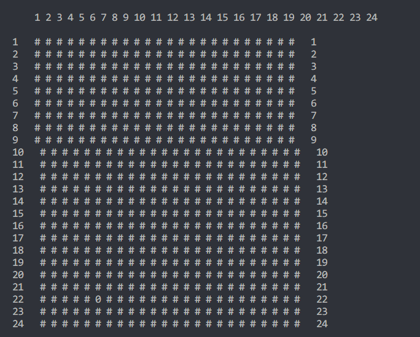
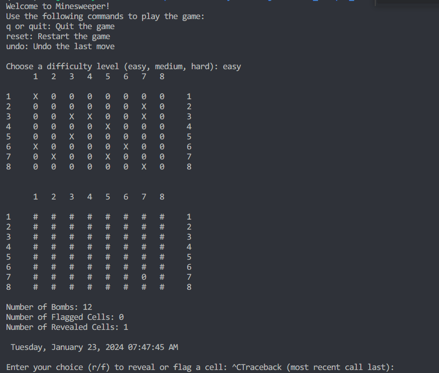
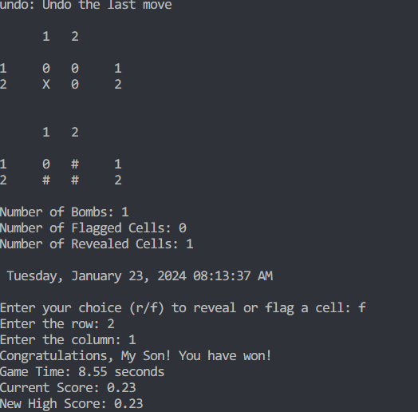
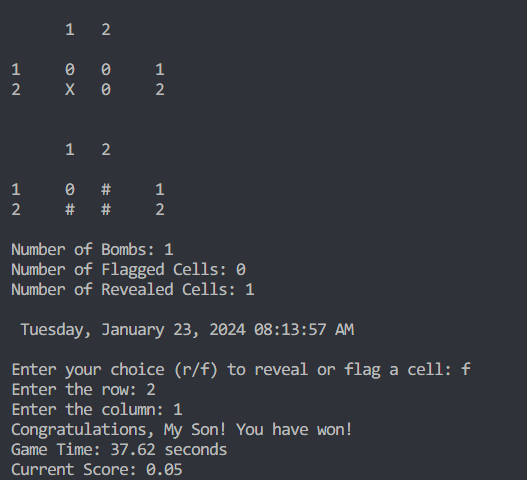
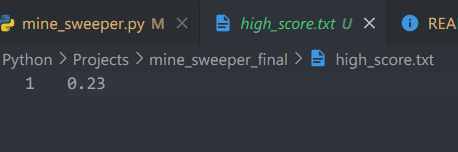
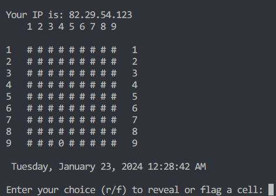
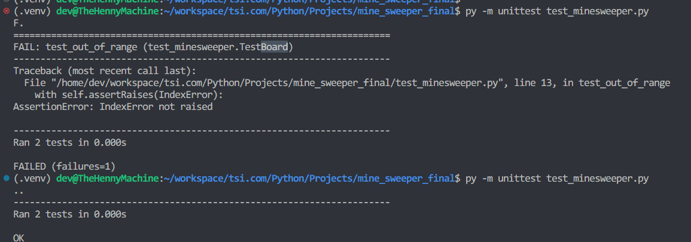

# Minesweeper

This is a simple implementation of the classic Minesweeper game in Python CLI.

## Game Rules

The game board is a 2D grid. Each cell in the grid may contain a bomb. The objective of the game is to reveal all cells in the grid that do not contain a bomb. If a cell containing a bomb is revealed, the game is over.

Each cell that does not contain a bomb contains a number indicating the total number of bombs in the eight neighboring cells i.e. the cells surrounding it (diagonals included). If a cell has no neighboring bombs, all neighboring cells are revealed.

# Intuition

Each Cell has no idea of its position in the board. It only knows whether it contains a bomb or not. The Board class is responsible for keeping track of the position of each cell in the board.

The Board class has a method `get_neighbours` that returns a list of all neighbouring cells of a given cell, and handles all the logic of checking whether the cell is on the edge or in the corner of the board.

The class starts the game by revealing a random cell in the board. If the cell contains a bomb, the game is over. Otherwise, the game continues.

When a cell is revealed, the Board class checks whether the cell contains a bomb. If it does, the game is over. Otherwise, the Board class checks whether the cell has any neighboring bombs. If it does not, the Board class reveals all neighboring cells. If it does, the Board class reveals only the cell.


# Installation

Clone the repository to your local machine:

```shell
 https://github.com/KingPsychopath/TSI-Study.git
```

Then, configure your environment using CLI or GUI:

## CLI

In the terminal, navigate to the root directory of the project and run the following command to install the required dependencies:

```shell
# Navigate to the root directory of the project
cd Python/Projects/mine_sweeper_final

# Create and activate virtual environment
python3 -m venv venv
source venv/bin/activate

# Install dependencies
pip3 install -r requirements.txt

# Use this to deactivate your Virtual Environment where necessary; however note you may no longer have access to the dependencies
deactivate
```

# Usage

Run the following command to start the game, once installation is complete:

```shell
python3 minesweeper.py
```

Select the difficulty of the game by entering, easy, medium or hard.

# Implementation

The Game uses two classes: `Cell` and `Board`.

## Cell

The `Cell` class represents a single cell in the game board. It has the following attributes:

- `is_bomb`: A boolean indicating whether the cell contains a bomb.
- `is_revealed`: A boolean indicating whether the cell has been revealed.
- `is_flagged`: A boolean indicating whether the cell has been flagged by the user.
- `value`: An integer indicating the number of neighboring cells that contain a bomb; this is only set upon revealing the cell. (Defaults to 0)

## Board
The board is displayed from 1-n, where n is the number of cells in the board. The cells are arranged in a 2D grid. The first cell is in the top left corner, and the last cell is in the bottom right corner.

The board is handled from 0-(n-1) in code logic, where n is the number of cells in the board.

The `Board` class represents the game board. It has the following attributes:

- `board_size`: An integer indicating the size of the board. (Used to calculate the number of rows and columns)
- `num_bombs`: An integer indicating the number of bombs in the board.

- `board`: A 2D list of `Cell` objects representing the game board.
- 'bomb_symbols': A list of strings representing the symbols used to represent bombs in the game board.

The board is represented in printing as a 2D grid of symbols. The symbols used are: 

- `#`: Represents a cell that has not been revealed.
- `X`: Represents a cell that contains a bomb.
- `0-9`: Represents a cell that has been revealed. The number indicates the number of neighboring cells that contain a bomb.

## Cell Neighbours

The `Board` class has a method `get_neighbours` that returns a list of all neighbouring cells of a given cell. The method takes the following arguments:

### Edges & Diagonals

The `min` and `max` functions are used here to ensure that the indices stay within the boundaries of the 2D matrix.

- `max(0, row - 1)` and `max(0, col - 1)` ensure that the indices do not go below 0. In Python, negative indices are valid and start from the end of the list. So, without this check, `row - 1` or `col - 1` could be negative and would not give the expected result.

- `min(len(matrix), row + 2)` and `min(len(matrix[0]), col + 2)` ensure that the indices do not exceed the dimensions of the matrix. Trying to access an index that is equal to or greater than the length of the list will raise an `IndexError`.

So, the `min` and `max` functions are used to keep the indices within the valid range, which is from 0 (inclusive) to the length of the dimension (exclusive).

This allows the function to correctly get the neighbours of a cell even if the cell is on the edge or in the corner of the matrix.

*+ 2 because the `range` function is exclusive of the upper bound and we want the cell itself to be included in the range as well as its neighbours.*


# Issues Faced

- Cells with no neighbouring bombs causing infinite recursion depth, because they reveal all neighbouring cells, which in turn reveal all their neighbouring cells, and so on...
- Win condition does not check whether user just flagged every single cell in the board (which is a valid way to win the game, but not the intended way)
- Struggled keeping mental note of the indices of the cells in the board. I kept getting confused between the indices of the cells in the board and the indices of the cells in the 2D list representing the board.
- Game Lose condition was working, however the game would continue to run after the game was won. This was because of a misplaced conditional statement in the check_win function (the second conditional statement was not indented properly)
- Number of bombs was increasing on reset. This was because I was not resetting the board when the game was reset. I was only resetting the cells in the board.

## Formatting and Printing the Game

The `print_board` function is responsible for printing the game board. Originally, I was using the `print` function to print each row of the board. However, this resulted in the board being printed as a list of lists, which was not very readable; especially when double digit row numbers were used that shifted the columns to the right.



So, I used the `join` function to concatenate the column numbers with a space separator. This allowed me to print the column numbers at the top of the board. As well this I used string formatting to print the row numbers at the start of each row, column numbers at the top and lastly each individual cell with pre-defined spacing; this allowed me to print the board in a grid format.



## High Score System & Win Condition

I was having issues with my win condition not validating correctly, and therefore not outputting the high score.
It took some time to figure out that the issue was with the win condition and not the high score system.

I was able to fix the issue by changing the win condition to check whether the number of cells revealed was equal to the number of cells in the board minus the number of bombs in the board.

The expected output and behaviour of the high score system is as follows (pictures are ordered in linear time):




The current high-score is saved to a high_score.txt file in the same directory as the minesweeper.py file. The high score is saved as an integer as calculated as the board size multiplied by the number of bombs in the board divded by the time taken to complete the game.



## Formatting
The date and time prior to formatting looked like this which was ugly and not very readable:

```shell
2024-01-23 00:26:16.487805+00:00 
```

So, I used the `datetime` module to format the date and time to look like this:

```shell
 Tuesday, January 23, 2024 12:28:42 AM 
```

The `fromisoformat()` function is a method in Python's `datetime` module. It takes a string in the ISO 8601 format (YYYY-MM-DD[T]HH:MM:SS), and returns a `datetime` object.

To make the date more human-readable, you can use the `strftime()` method of the `datetime` object, which formats a `datetime` object as a string. Here's an example:

```python
formatted_time = current_time.strftime('%A, %B %d, %Y %I:%M:%S %p')
print(formatted_time)
```

 `%A` is replaced by the weekday name, `%B` is replaced by the month name, `%d` is replaced by the day of the month, `%Y` is replaced by the year, `%I` is replaced by the hour (12-hour clock), `%M` is replaced by the minute, `%S` is replaced by the second, and `%p` is replaced by `AM` or `PM`.

So, if `current_time` is `datetime.datetime(2024, 25, 12, 15, 0)`, `formatted_time` will be `'Wednesday, December 25, 2024 15:00:00 PM'`.


# Planned Features
- [X] Add a timer to the game.
- [ ] Add a GUI to the game using PyGame or Tkinter like example of res/
- [X] Add a high score system.
- [ ] Add a leaderboard.
- [ ] Add a save/load feature (database? pickle module to serialise game and save to field, key is username/id)
- [X] Add a state system to allow user to undo moves.
- [X] Add a difficulty setting. (Easy, Medium, Hard= Affects board size and number of bombs)
- [ ] Add a custom board setting. (User can specify board size and number of bombs)
- [X] Add a hint feature. (Reveals a random cell that does not contain a bomb)
- [X] Add a flag counter. (Displays the number of flags the user has placed)
- [ ] Add a flag limit. (User can only place a certain number of flags)
- [ ] Add flask integration to make it a web app after creating the GUI.
- [ ] Add a multiplayer mode. (Players take turns revealing cells. First player to reveal a bomb loses)
- [X] Add an API call to get current local time or weather from the internet; just because.
- [ ] Store the location of the bombs in the board in a database, and use this to generate a heatmap of the most common bomb locations; also to reduce use of loops to check for bombs and increase efficiency.

# API Functionality

Used the [World Time API](http://worldtimeapi.org/) to get the current time in the user's local timezone.
Used the [IPify API](https://www.ipify.org/) to get the user's public IP address.

## Screenshots



# Testing

## Unit Testing

The program uses a unit testing framework called `unittest` to test the functionality of the `Board` class.

This can be run using the following command:

```shell

py -m unittest test_minesweeper.py

```

The current tests cover the following scenarios:

These tests cover the following scenarios:

`test_reveal_cell`: Reveals a cell and checks if it is revealed.
`test_flag_cell`: Flags a cell and checks if it is flagged.
`test_out_of_range`: Tries to reveal a cell outside the range of the board and checks if it raises an IndexError.
`test_reveal_bomb`: Reveals a bomb cell and checks if the game is over.

This is the output upon running two tests, the initial test I made sure there was no IndexError checks within the reveal cell function, and the second test I made sure that the reveal cell function was working as intended.



## Integration Testing

...

# References

- [Minesweeper - Wikipedia](https://en.wikipedia.org/wiki/Minesweeper_(video_game))
- [How to code Minesweeper in Python](https://www.youtube.com/watch?v=Fjw7Lc9zlyU&t=1457s)
- [Date API](http://worldtimeapi.org/)
- [Time API](https://ipify.org/)