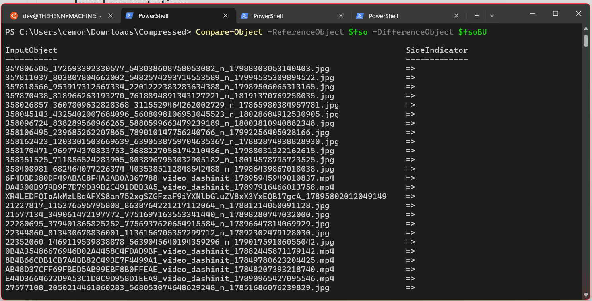

# Compare Files Between Two Directories

A simple PowerShell script to compare files between two directories; with a progress bar to show the comparison progress; feel free to use it; I found it useful for comparing files between my Instagram and Facebook data exports.



## Usage

```powershell
.\compareDif.ps1 "C:\Path1" "C:\Path2"
```

# Output

```powershell
InputObject                  SideIndicator
-----------                  -------------
burnidols_1134998761224922      <=
bxks_600981521301086            <=
```

The InputObject and SideIndicator are properties in the output of the Compare-Object cmdlet in PowerShell.

**InputObject**: This represents the actual objects that are being compared. In your script, these would be the files and directories in the paths you specified.

**SideIndicator**: This shows where the difference lies. It can have one of three values:

**==:** The object appears in both the reference and difference lists (i.e., it's the same in both directories).

**<=:** The object appears only in the reference list (i.e., it's only in the first directory).

**=>:** The object appears only in the difference list (i.e., it's only in the second directory).

# Intuition
The script will compare the files in the two directories and output the differences in the console. It will also show a progress bar to indicate the comparison progress.


# Implementation

In this script, we first count the total number of files in each directory. Then, while we're getting the list of files in each directory, we update a progress bar using Write-Progress. The -PercentComplete parameter is calculated as the current file number divided by the total number of files, multiplied by 100 to get a percentage.

We then compare the files in the two directories using Compare-Object. The -PassThru parameter is used to output the differences in the console.

The Position attribute is used to specify the position of the parameters when calling the script. The first parameter ($a) has a position of 0, and the second parameter ($b) has a position of 1.

Please note that this script will show progress for scanning directories, not for the comparison process. As mentioned earlier, Compare-Object doesn't provide progress information, so we can't add a progress bar to it directly.

# Requirements

- PowerShell 3.0 or later
- Windows 7 or later
- Enable execution policy for the script to run (Settings/System/for Developers/PowerShell/Execution Policy/Allow scripts to run)

You can also run the following command in PowerShell to enable the execution policy:

```powershell
Set-ExecutionPolicy -ExecutionPolicy RemoteSigned -Scope CurrentUser
```

This command sets the execution policy to Unrestricted for the current user, which means PowerShell will run scripts without any restrictions.

Please note that running scripts without any restrictions can be a security risk, as it allows all scripts, including those you download from the internet, to run on your system. Be sure to only run scripts from sources you trust, and consider setting the execution policy back to Restricted when you're done running your script.

If you want to bypass the execution policy just for a single script, you can do so by opening a PowerShell session and running your script like this:

```powershell
powershell -ExecutionPolicy Bypass -File .\compareDif.ps1 -a "C:\Path1" -b "C:\Path2"
```


