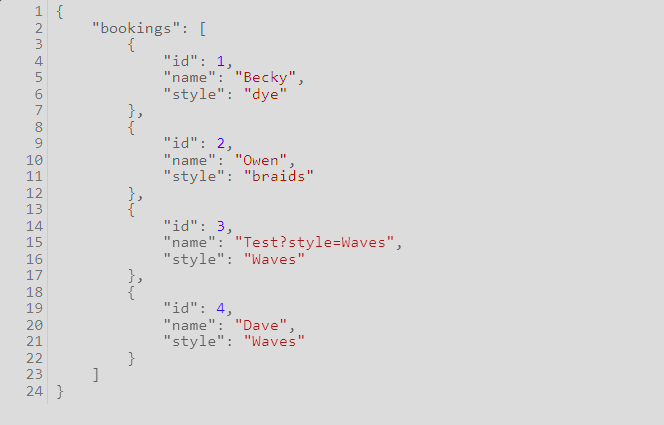
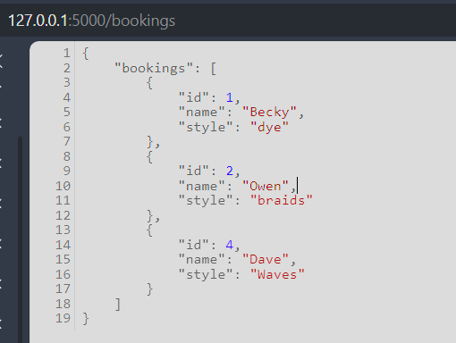

# Booking System API

This is a simple booking system API that allows users to book appointments with a hair salon. The API is built using Flask and SQLAlchemy; it is a RESTful API that allows users to create, read, update, and delete bookings; data is stored in a SQLite3 database.

## Getting Started

To get started, you will need to install the required packages(preferably within a Virtual Environment). You can do this by running the following command:

```bash
pip install -r requirements.txt
```

# Creating the SQL Database from ORM

This notebook is a step-by-step guide to create the SQL database from the ORM. The ORM is a Python library that allows us to define the database schema and interact with the database using Python.

You could use SQLite3 directly in bash, but the ORM is a more powerful tool that allows us to interact with the database using Python.

There are two ways to create the database from the ORM, one in Flask Shell and the other in Python Shell.
### In Flask Shell
```python
# Open Flask Shell
flask shell
>>> db.create_all()
```

### In Python Shell
```python
# Open Python3
python3
>>> from <module-name> import <database-variable-name>

# Create the database
>>> db.create_all()
```

If you run into issues with the command, due to the application context not being set, you can use the following command to set the application context:

```python
python3
>>> from app import app, db
>>> with app.app_context():
...     db.create_all()
``` 

# Managing the Database

## Appending to the Database

To append to the database, you can use the following commands:

```python
# Open Flask Shell (preferred over python so that the application context is set)
> flask shell
>>> booking1 = Booking(name="Becky", style="dye")
>>> db.session.add(booking1)
>>> db.session.commit()
```

## Querying the Database

To query the database, you can use the following commands:

```python
# Open Flask Shell (preferred over python so that the application context is set)
> flask shell
>>> Booking.query.all()
```

## Updating the Database

To update the database, you can use the following commands:

```python

# Open Flask Shell (preferred over python so that the application context is set)

> flask shell
>>> booking1 = Booking.query.filter_by(name="Becky").first()
>>> booking1.name = "Becky Smith"
>>> db.session.commit()
```

## Deleting from the Database

To delete from the database, you can use the following commands:

```python
# Open Flask Shell (preferred over python so that the application context is set)
> flask shell
>>> booking1 = Booking.query.filter_by(name="Becky Smith").first()
>>> db.session.delete(booking1)
>>> db.session.commit()
```

# Running the Application

To run the application, you can use the following command:

```bash
flask run
```

## Testing the Application

Go to the following URL in your browser:

```bash
http://127.0.0.1:5000/<path>
```

Where path is any of the following defined routes in the code:
`/bookings`, `/bookings/<id>`, `/bookings/<id>/update`, `/bookings/<id>/delete`, `/bookings/new` 

# RESTful Routes

RESTful APIs typically use a set of standard routes for interacting with resources. Here are the standard routes for a resource called `bookings`:

1. `GET /bookings`: Get a list of all bookings in JSON format
2. `GET /bookings/<id>`: Get a single booking by ID in JSON format
3. `POST /bookings/create`: Create a new booking
4. `POST /bookings/<id>/update`: Update a booking by ID
5. `POST /bookings/<id>/delete`: Delete a booking by ID


I am experimentating with creating different API versions; one that uses arguments in the URL and another that uses '/' paths to specify the arguments.

# Why JSON

If you're building a RESTful API with Flask, it's a good practice to use `jsonify` for all your responses. This is because RESTful APIs typically communicate with their clients by sending and receiving JSON data.

Using `jsonify` ensures that:

1. The data you're returning is properly converted into JSON format.
2. The `Content-Type` header of the response is set to `application/json`, which tells the client that the response is JSON.

Even for error messages or other non-success responses, it's a good idea to return a JSON object with information about the error. This provides a consistent interface for your API clients.

Here's an example of how you might return an error message as JSON:

```python
from flask import Flask, jsonify

app = Flask(__name__)

@app.route('/')
def index():
    return jsonify({'error': 'An error occurred'}), 400
```

In this example, if you access the `/` route, Flask will return a JSON response with an error message and a status code of 400.


# Interpreting HTTP Status Codes

HTTP status codes are three-digit numbers that indicate the result of an HTTP request. They are part of the HTTP/1.1 standard and are categorized into five classes:

1xx: Informational
2xx: Success
3xx: Redirection
4xx: Client errors
5xx: Server errors

In the context of Flask, if you don't specify a status code, Flask will default to 200. If you want to return a different status code, you can specify it as the second value in the return statement, like this:

# Error Handling

The choice between raising an exception and returning a 404 response directly depends on how you structure error handling within the Application.

We can do this two ways, locally within the route(at the client) or globally for the entire application.

## Locally within the route

```python
if booking is None:
    return jsonify({'message': 'Booking not found'}), 404
```

For Example within:
```python
@app.route('/bookings/<int:booking_id>')
def get_booking(booking_id):
    booking = Booking.query.get_or_404(booking_id)
    return jsonify(booking)
```

This will immediately return a 404 response with the error message.

## Globally for the entire application

```python
if booking is None:
    raise ValueError('Booking not found')
```
Then, you can have an error handler for ValueError:

```python
@app.errorhandler(ValueError)
def handle_value_error(error):
    return jsonify({'error': str(error)}), 404
```

This way, whenever a ValueError is raised, Flask will call the handle_value_error function and return its response to the client.

Both approaches are valid, and the choice between them depends on your specific requirements and how you prefer to structure your error handling.

# Screenshots
Adding Extra Users
```shell
(.venv) (main) dev@THEHENNYMACHINE ~/workspace/boot.dev/Python/API $ curl -I -X 'POST' http://127.0.0.1:5000/bookings/create?name=Test?style=Waves
HTTP/1.1 200 OK
Server: Werkzeug/3.0.1 Python/3.10.12
Date: Sun, 11 Feb 2024 10:09:14 GMT
Content-Type: application/json
Content-Length: 53
Connection: close

(.venv) (main) dev@THEHENNYMACHINE ~/workspace/boot.dev/Python/API $ curl -I -X 'POST' http://127.0.0.1:5000/bookings/create?name=Dave&style=LowCut
```


```shell
(.venv) (main) dev@THEHENNYMACHINE ~/workspace/boot.dev/Python/API $ curl -I -X 'DELETE' http://127.0.0.1:5000/bookings/del/3
HTTP/1.1 200 OK
Server: Werkzeug/3.0.1 Python/3.10.12
Date: Sun, 11 Feb 2024 10:12:38 GMT
Content-Type: application/json
Content-Length: 134
Connection: close
```


# Commentary

## Learned
- JSONIFY is a good practice for RESTful APIs; however you can only serialize specific data types; so converting the ORM object from the database to a dictionary is necessary.
- The ORM allows us to define the database schema and interact with the database using Python.
- Browser URL field, can only send GET Requests, however you can send POST requests also from forms.
- 


