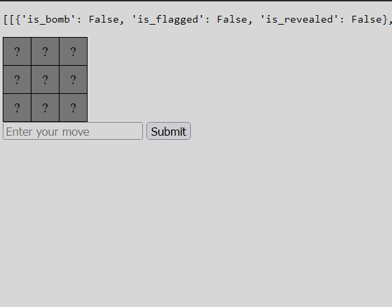

# Mine Sweeper Flask

## Project Goal
Create a web app that allows a user to play mine sweeper.

Using Mine_Sweeper.py as a base, create a web app that allows a user to play mine sweeper. 

- The user should be able to enter a move and see the results of that move.
- The user should have reasonably understandable output given by the game in response to their actions.
- The user should be able to win or lose the game. 
- The user should be able to start a new game.

## Early Stages

