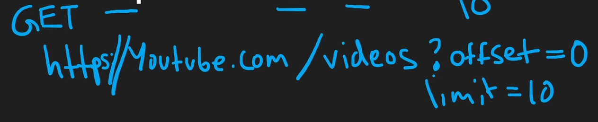
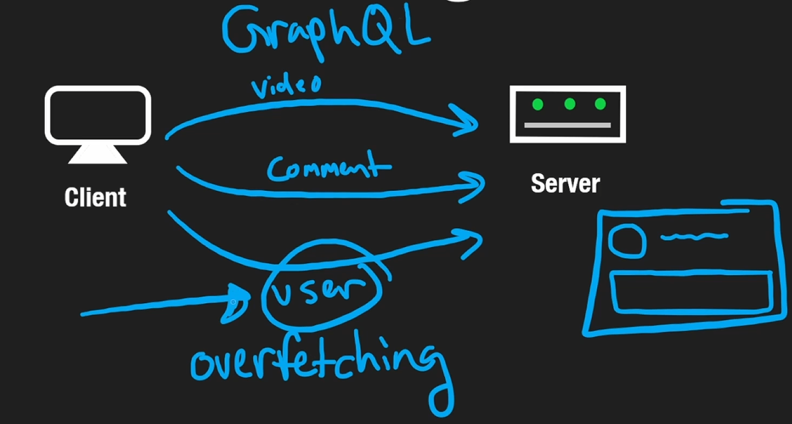
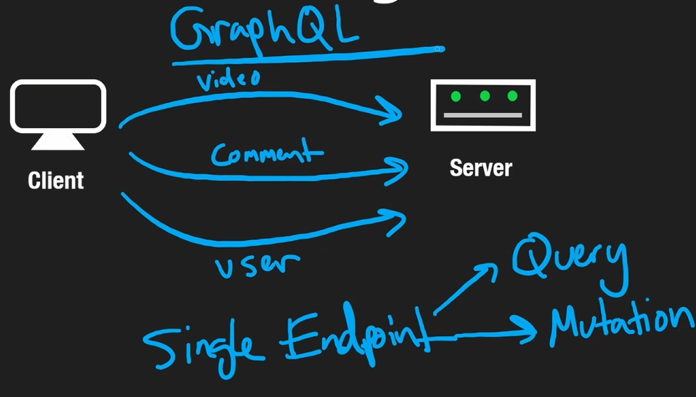

Now we know how information is sent on an application level using HTTP or Websockets, we have a way of creating API's.
API stands for Application Programming Interface. An API is just a set of rules and protocols for building and interacting with software applications.

APIs are essential in software development as they allow different software systems to communicate and share data with each other, promoting integration and modularity.

For example in a browser we have a local storage, which is a way of storing information persistently that is specific to particular machine. You can toggle a light or dark theme in browser and this option is typically stored in local store; to access local store there is an API, in this context an API is the interface we use to access the local store.

By the far the most important and common API Paradigms are [[RESTful APIs]], [[GraphQL]] and [[gRPC]].

# REpresentation State Transfer
REST is not a protocol, but more of a set of loose restrictions/standardizations that are typically applied on top of the HTTP protocol

Nowadays people think REST is synonymous with HTTP however that is not typically the case as it's just a set of rules you implement.

## REST API's are Stateless
#### Stateful
Suppose we have an endpoint `GET https://youtube.com/videos`, **every endpoint is essentially a noun server**.
**Every request type is the verb**, that determines the action we are taking on this resource.

In this case we are requesting a resource at the given path `/videos` in this case, our server could have some code to respond to GET requests at this particular endpoint and as a result send the user a list of 10 videos.

If we send an identical request, we'd expect to receive 10 newer videos, and not the same 10 videos as the user. One way to handle this is for the server to store a session id for each user and resultingly know that it has sent the user 10 videos already and to send the next 10 for the next request. However, this is **NOT STATELESS**, as the server remembers it has seen me before; this is stateful.

**===The main reason we care about statelessness is, say we had a load balancer sending our request to different servers; each server is independent of one another with different session ID's. They may not be able to update each other's data. If I request video's from a server that doesn't know I requested videos before, it will just send me the same page.===**
### Statelessness
**Stateless does not mean there is no data being stored**.  Stateless means from the perspective of the server it is not stored on the server, so you could store the data in a centralised database, that all the servers communicate with.

In order to make this sort of request stateless, we would pass the information about the request within the `path` of the URL. **We could then use pagination to split a long list of videos into pages**, and respond to the client with the number of pages, and where to start the page from they requested.

If we wanted to go to the next page, we'd set the offset to 10 and skip the first 10 videos and send the next 10. This is **stateless**.

> [!NOTE]
> This allows us to further scale horizontally, and add as many servers as we want and not have to worry about state across the servers for the user.

We typically send data in RESTful API's as JSON objects, which is a human readable key:value pair. [[JSON Parsing]]
```JSON
{
    "name": "John Doe",
    "favourite foods": {
		"fruits": "apple",
		"meats": "steak"
    }
}
```
# GraphQL
GraphQL is not a Protocol, it is built on top of HTTP and typically only use `POST` Requests as we need to send data in a body and `GET` requests do not have a body.

We have a single endpoint with GraphQL, with two operations:
1. Query (READ)
2. Mutation (UPDATE/DELETE/POST)

In REST, you typically use GET for fetching data, which is idempotent and can be cached, as the same request always yields the same response. This allows clients, proxies, and servers to cache the response, improving performance.

`POST` REQUESTS are not [[Idempotent]]. HTTP specifications suggest not to cache POST requests, as the same request could lead to different results. This means that, by default, GraphQL responses might not be cached as effectively as REST responses.

## The Dilemma
As our application grows we will begin to start accessing a lot of resources, as the number of resources grows there will be a number of problems that arise.
### Over-fetching

When we make requests and we want some user information, for example we want to list some comments. For each comment we want the profile photo, username and the actual comment.

However a `GET https://youtube.com/user?comments` request will return a much larger response body than the information we want; a user will have a lot more information associated with them than what we require for printing the comments.

With a REST API if we have 5 comments, we will end up fetching 5 respective entire user JSON object responses. We need a way to specify the particular part of a resource that we want. We could add conditional statements on our back-end to get and return only the comments, however as this need grows for other requests we are going to have to make A LOT of case checks for each and every individual part of a resource we want.

GraphQL can specify for every resource each and every field that it wants, and only those fields get sent in the response to the client. This basically saves performance costs.

### Under-fetching
Underfetching is a problem that can occur in API design where a client has to make multiple requests to get all the data it needs. This is often seen in RESTful API designs.

For example, consider a video streaming service with a REST API. If you wanted to get all the comments for a specific video, you might first have to make a GET request to `/videos/{videoId}` to get the video details. The response might include some basic details about the video, but not the comments. To get the comments, you would then have to make another GET request to `/videos/{videoId}/comments`. This is underfetching: the initial request didn't provide all the data you needed, so you had to make additional requests.

GraphQL, on the other hand, allows the client to specify exactly what data it needs in a single request. With GraphQL, you could make a single query that asks for the video details and all its comments at the same time. The server would then return a response that includes all the requested data. This eliminates the problem of underfetching, as all the necessary data is fetched in a single request.

Here's an example of how you might do this in GraphQL:
```json
query {
  video(id: "videoId") {
    title
    description
    comments {
      text
      author
    }
  }
}
```
In this query, you're asking for the title, description, and comments (including the text and author of each comment) of a specific video. The server would respond with all this data in a single response.



Unlike REST API's, GraphQL have a schema. You can't just query anything, the structure of your query has to match what is available within the resource unlike REST API's.
### Schema
In GraphQL, the structure of the data is defined by a schema. This schema serves as a contract between the client and the server, defining what queries are available, what types of data can be fetched, and the relationships between these types.

Each type in the schema corresponds to a resource and defines a set of fields that can be queried on that resource. Each field has a specific type, and the types are strictly enforced. This means you can't just query any field on a resource; the field must be defined in the schema.

For example, if you have a `User` type in your schema with fields `id`, `name`, and `email`, you can't query a `phone` field unless it's defined in the schema.

Here's an example of what a simple GraphQL schema might look like:

```graphql
type User {
  id: ID!
  name: String!
  email: String!
}

type Query {
  user(id: ID!): User
  allUsers: [User]
}
```

In this schema, we have a `User` type with `id`, `name`, and `email` fields. We also have a `Query` type that defines two queries: `user`, which fetches a single user by ID, and `allUsers`, which fetches all users.

In contrast, REST APIs don't have a strict schema defining the structure of the data. You can make a GET request to any endpoint, and the server will return whatever data it has for that endpoint, whether or not it exists(404 error). The structure of the data can vary between different endpoints and can even change over time. This flexibility can be a strength, but it can also lead to inconsistencies and make it harder to understand what data is available.

# gRPC
gRPC is not a protocol also, however it is built on top of HTTP/2.0

gRPC cannot typically be used natively from a browser; if you want to make requests from a browser using gRPC you need a proxy because gRPC needs some fine-grained control over HTTP/2 which browsers do not typically offer.

gRPC is typically used for server to server communication; because performance wise it is objectively faster and more efficient than REST API's, because instead of sending raw JSON. gRPC sends data in Protocol Buffers that are serialised into a binary format.

This means we are sending a smaller amount of data than we would with a REST API(less boilerplate means more throughput), which makes gRPC just objectively faster.

Because gRPC uses HTTP/2 it also means that it enables streaming between a client and a server, server and client and in full-duplex back and forth, just like with websockets.

**Don't be a hero, just use rest with json-schema/open-api, enjoy all the great tooling and simplicity.**
