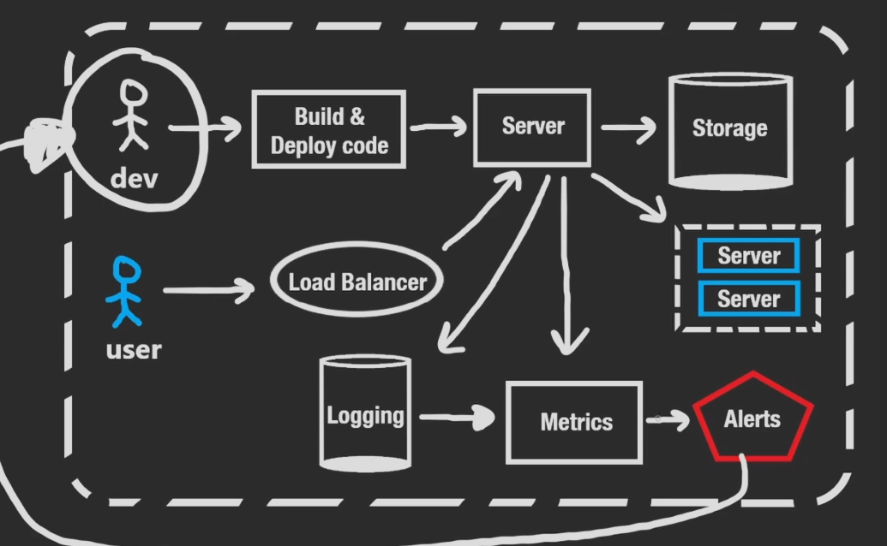

## Developers Perspective
As a developer, we write code, which has to be built and deployed somewhere on some server to run on.

The building/deployment could happen on the developers local machine, but in business this is more common on a Continuous Integration/Continuous Development Server.

The server could need to store data for persistence, preferably this is not done locally on the same machine but by means of some data store. This data store could be an entirely different dedicated machine, or a bunch of machines all over the world; i.e. a distributed database.
### Logging
For us to get insight in how our server is running we also use log statements, which we can send out to some external service. This can happen every time a user makes a request that either succeeds or fails.
### Metrics
Basically a system healthy check-up, we can have a dashboard that shows us how our server is running, whether it is responding to all requests, are some requests failing, are the resources of our server being taken up.

Some of the metrics might directly come from logs, for example we could log every failed response and use this to create metrics in terms of time-series charts (fail rate over time)
### Alerts
We don't want our users to have to email/contact us when something goes wrong; so we want a push notification from the metrics system when something goes wrong; we can accomplish this by setting up a trigger.

Our metrics data can feed data into an alerting service, which will alert us when a metric has reached a threshold.

**===For example, if a 95% of users receive a successful response, if that percentage dips to below 80% we could trigger an alert that something is wrong===**
## Users Perspective
They communicate with the server typically, so say they send a HTTP GET requesting the website, our server could handle response back using the built code we have deployed for the web services.

If we have a degradation in service and slowdown and too many users are requesting information from our server, we would need to determine the bottleneck and whether it's the CPU, RAM or Disk etc. and upgrade it; this is an example of Vertical Scaling. [[Vertical vs Horizontal Scaling]]

However computers have limitations in terms of upgrading, and we will hit the costs limitations way before we hit them. We can use Horizontal scaling, in order to create multiple servers running our deployed code; **so that if we have more users they will not have to talk to a single server and we can handle more requests at the same time.**

## Load Balancers

The problem we introduce when we have multiple servers is how do we know which server the request should go to, we use [Load Balancers](Notes/../Load%20Balancers.md) to handle this, so that the request can be forwarded to the server with the minimal amount of traffic; and each server will have a balanced amount of traffic.

## Third-party Servers

Our servers don't have to run in isolation, and may communicate with our servers through use of [[RESTful APIs]]'s to extend functionality outside of themselves i.e. Stripe for payment systems, or Weather API to get the current weather/time
