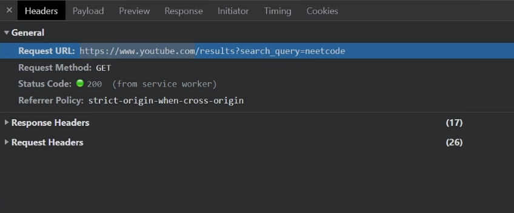
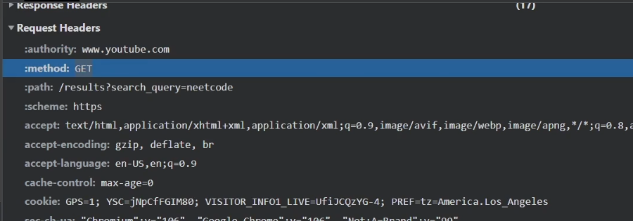
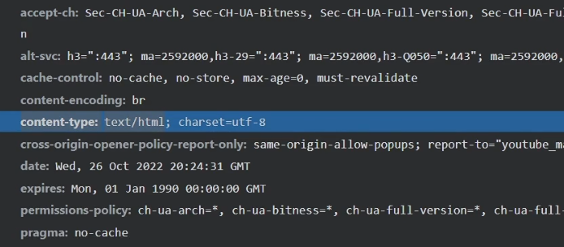

[[HTTP]]

There are different types of application layer protocols for communication of different things.

- HTTP - web applications and websites
- Websockets
- FTP - file transfer (Port 21)
- SMTP - Mail (Port 25)
- SSH - securely connect to another machine over CLI
- WebRTC - for video and audio streaming

All of these except for WebRTC are built on TCP; WebRTC uses UDP for obvious reasons.

> [!NOTE]
> Client-Server only matter within the context of a single HTTP Request.
> If a computer is sending a HTTP request we consider it the **client**.
> If a computer is responding to a HTTP request we consider it the **server**.

> Remote Procedure Calls
>
> # Remote Procedure Call (RPC)
>
>  > **BASICALLY EXECUTING CODE THAT'S NOT ON OUR SINGLE LOCAL MACHINE**
>
> We use listVideo's locally and send that request. On the server there's a bunch of stuff happening behind the scenes before it returns a list of videos.
>
> RPC, or Remote Procedure Call, is a protocol that one program can use to request a service from a program located in another computer on a network without having to understand the network's details.
>
> In other words, it allows a client application to execute a function or method on a server application as if it were a local function call, hiding the complexities of the network layer. This makes distributed development more straightforward by abstracting the networking code.
>
> Here's a simplified flow of how RPC works:
>
> 1. The client calls the client stub with the procedure parameters. The call is a local operation.
> 2. The client stub packs the parameters into a message and makes a system call to send the message. Packing the parameters is called marshalling.
> 3. The client's OS sends the message from the client machine to the server machine.
> 4. The server's OS passes the incoming packets to the server stub.
> 5. The server stub unpacks the parameters from the message. Unpacking the parameters is called unmarshalling.
> 6. Finally, the server stub calls the server procedure with the unpacked parameters.
>
> The server's response goes through a similar process in reverse.
>
> RPC is used in a variety of applications, including distributed file systems, network management, and web services.

# HTTP

HTTP is just a request, respond protocol. The client initiating a request, after the initial TCP handshake; and the server responding. There's no state management, everything needed for a single connection is handled within it. The client and server don't need to know anything else about each other other than what has been included in the request and response.

Every HTTP request has two main components, the header and the body which is the response.

## Headers

### General Header

There typically 3 groups of headers. The General Header, which contains basic stuff like the URL we are making the request to, the request method and the status code which is whether the request succeeded/failed/redirected.

### Request Header

The request header is what the client is setting, in the request; it can include stuff like

1. `accept:` The data format you are actually going to accept i.e. a html page
2. `authority:` the base URL
3. `method: `the Request method
4. `path:` the path to the resource you are requesting
   

### Response

The response header is what the server is setting, in response, for example the `content-type` header shows what type of response was actually sent back

# Routing

We could make a `GET` request to `http://youtube.com/` and this route would be it's own endpoint, and this would return a HTML page. We could make a `POST` request to the same URL `http://youtube.com/` and this would be a separate endpoint and could perform some different functionality like say for example create an account.

You can use the HTTP Methods `GET, POST, PUT, DELETE` to do whatever you want; it all depends on your implementation.

You wouldn't typically use GET methods to sign in to an application as **a GET REQUEST does not have a body**(they only have headers) so you'd have to pass the user information over the very visible URL path, which isn't the safest thing for somebody standing over your shoulder. Instead you'd use a POST request, to send the user and password within the HTTP message body.

GET Requests are Idempotent.

# Status Codes

Tells you who made a mistake at the HTTP level between the Client and Server.

- `100-199`: Informational responses. These are very rare.
- `200-299`: Successful responses. Hopefully, most responses are 200's!
- `300-399`: Redirection messages. These are typically invisible because the browser or HTTP client will automatically do the redirect.
- `400-499`: Client errors. You'll see these often, especially when trying to debug a client application
- `500-599`: Server errors. You'll see these sometimes, usually only if there is a bug on the server.

# SSL / TLS

undefined
