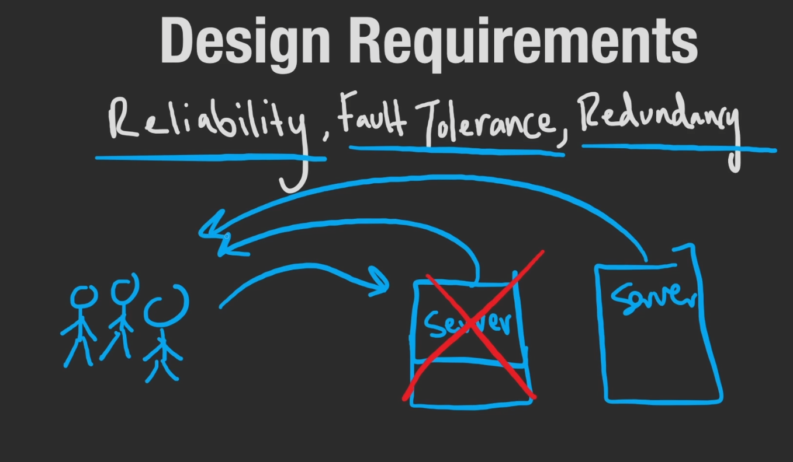
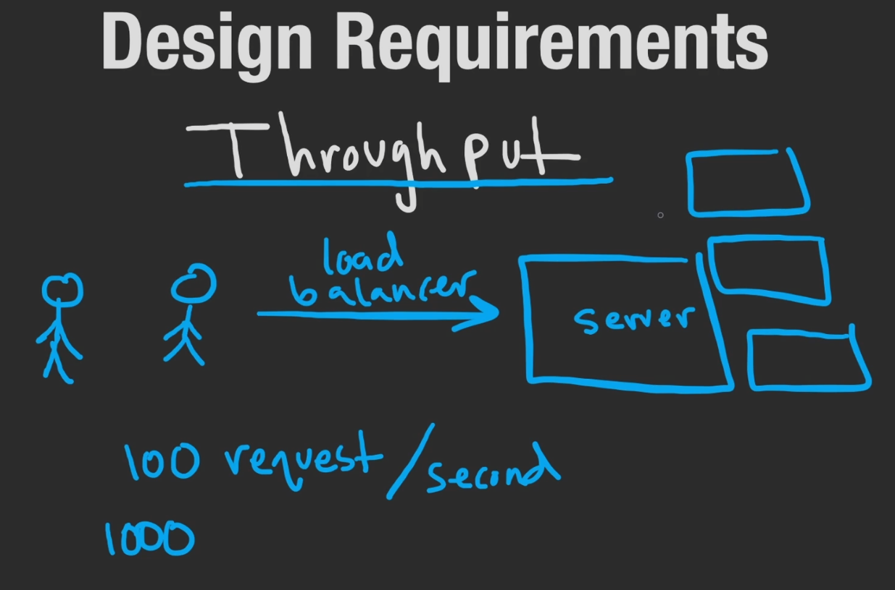
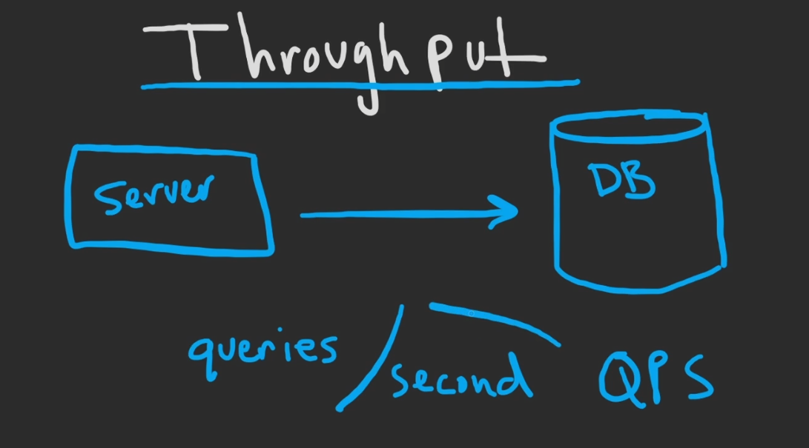

There is not always a straight forward answer just like in real-life. There can be experts on topics, but experts disagree.
We have to weigh the trade-offs of different designs, because there is not a perfect solution we take the option that happens to be better.

System design is not about analysing the facts, but more so the thought process.
# Design Requirements
No matter how complex the Systems become ultimately all we are doing is:
1. **Moving Data** - whether from one local machine to another, or one across the world to one local over a network
2. **Storing Data** - usually we store on databases, blob stores, file-systems or distributed file systems; it all boils down to which is more appropriate for the data type and size. Large data has to be stored efficiently.
3. **Transforming Data** - for example given a set of logs, we could aggregate the logs to create something more useful like a percentage of failed or succeeded connections in a server.

We want to get our design choices right, first time. As it is much easier to refactor bad-code, than it is to refactor a design change.

Imagine trying to change databases 6 months into application deployment because the store you chose was inefficient for your data, the planning, cost and down-time for migration would be hell. Let alone the time you'd have to take to rewrite portions of your application.

## The Good and The Bad
How do we know if a decision is good or bad when there are no absolutes? We have to measure the trade-offs.

One very important measurement we make about a service or application is it's availability. i.e. = total uptime of our service divided by the uptime and downtime.

Over a day our application was up for 23 hours / 24 hours which gives us an availability of 96%

### SLO's
Availability is typically used to define SLO's (Service Level Objective). As designers we want to target something for applications to meet for up-time

'We want our database to have five 9's of availability'
### SLA's
SLA = SLO + some extra stuff
(Service Level Agreement)
It's not just a goal but it is an agreement with the customer. Basically if we don't reach this level of availability, we will give you something for example a refund.

### Reliability
If a user makes a request to our server and it responses, that means our server was available but it does not mean that it was reliable

==**Reliability is the probability that our service will not fail**.== We can't typically calculate this, but generally speaking if we have a single server responding to users we know there is a large probability that the server could fail. Simply introducing another server to our system increases reliability and availability.

Vertical scaling however, may not increase reliability as we still only have a single server.
### Fault Tolerance
This idea that if a part of our service has a fault and the system is still able to run successfully, is called fault tolerance.

This means our system is tolerant to failures of the system. One of our servers goes down, but our system is still able to use another server.
### Redundancy
We could also call this redundancy; a backup; a fail safe.
We don't "need" the second server to respond to users, but it helps to have both of them because in the event of a fault or failure, we have multiple copies so our system can still run or our data is still safe and not lost.

### Throughput
**The amount of operations or data we can handle over some period of time.**

In a client-server interaction, we could request the throughput in terms of requests per second.

This could be useful in identifying how much a single server can handle from a given user; and can be used to calculate and provision the needed resources in planning.

If we know how the upper-bound of requests, we can exceed that in the amount of servers we have in waiting for those requests.

All of the ideas about availability, throughput and scaling also applies to databases.

Keeping data in multiple databases in sync is not the easiest thing, especially when one databases might be on the other side of the world.

Another method of throughput could be measuring how much data we can push/process per second

**==If we had a 1TB of data and process at 1GB/s, because 1TB is 1000 GB we know it would take 1000 seconds.==**

### Latency
Latency is **Just some period of time.**

For example in a client-server interaction, it would be the amount of time it would take for that operation to complete, the end to end operation; the request and response. We care about it from the user's perspective.

Latency could be caused by our network, physical distance from the actual server server responding; so one user in the same city as the server might a lower latency than another. Typically latency is measured in milliseconds.

**==If we can reduce the latency of a system; we can increase the overall throughput.==**.  If there is less of a delay to access the data, we can handle it much quicker.

> [!NOTE]
> This is why we use cache in a CPU, we lower the latency of required to read from ram by copying the frequently accessed data to cache.  Reducing the time to read said data, increases the time taken to complete the operation, thereby increasing the throughput
>
>**It's why in distributed systems, we introduce a second server on the other half of the world from the first, not only does this increase our availability and reliability, it also reduces the latency for users on the other side of the world.**

Another technique for reducing the latency is by having a [[CDN]].
