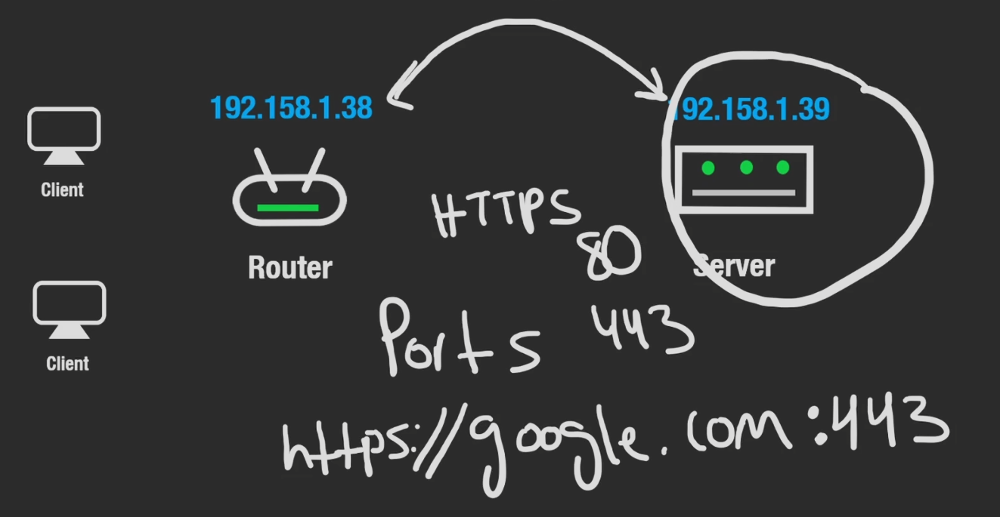

# How do Computers Talk?

If we have two computers, a client and a server. (Any server requesting information or requesting a change is typically the client, any server responding is typically the server)

For them to be able to communicate with one another, they need a way to identify each other. One way is similar to how we have mail for houses, each computer has an address. Specifically an IP Address.

## What is an IP Address?

An IP Address is a 32-bit integer, written with 12 digits in total separated by full-stop delimiters.
$0.12.345.678.910$ <- because this is 32 bit, all the digits do not go up to 999 so the largest IP address we can contain as a single integer is $256.256.256.256$ . This means there is a limit of 4 billion unique IP addresses; which is quite limiting as we have more people and machines than this on Earth. (We ran out some years ago they just get reshuffled and reassigned)

This is called IPv4 and the upgrade to it is Ipv6 which stores 128 bits and allows for 340,282,366,920,938,463,463,374,607,431,768,211,456 addresses.

## Communication

Typically communication between machines on the internet involves sending a "letter" stating who the message is from and who it to, alongside the actual message body within the envelope.

This message **is called a packet of data**; where a portion of the packet is reserved for metadata which is information about the message, this is called a **header**.

The rules of communicating that they use, the language so to speak is called the Internet Protocol i.e. TCP, UDP, HTTP.

What if instead of sending one letter in the mail; we wanted to send a book and we cannot increase the size of the envelope to a box. We could take the book, rip out the pages and a group of individual pages that can fit reasonably inside of the envelope one at a time.

There are different types of headers that can be attached to a packet for different purposes. An IP Header stores the to and from IP. A TCP header includes the sequence number of that packet, so that it can be reassembled by the server correctly. HTTP is what the application actually uses and worries about, this is where the message body is stored. In a single request there can be multiple protocols embedded in the packet, because they all live in a different layer and server a different purpose.

> [!NOTE]
> **TCP is a transport layer protocol, HTTP is an application layer protocol, IP is a network layer protocol.**

## Routing

### Public vs Private IP Addresses
For a server to be accessible, it needs to have a public IP Address; our client IP address doesn't necessarily need a public IP address as nobody is making requests to it. Our router is what has a public IP address and is internet facing. However locally, in our LAN(Local Area Network) it will assign a private IP address to each of the clients/machines connecting to it meaning the local machines should be able to communicate.

That is if they allow it themselves, for example if you ran a server on one and tried to connect to it from the other; you'd have to ensure your firewall and port forwarding is set-up. [[What are Ports]]

### Static vs Dynamic IP Addresses
Static IP Addresses are IP's that are constant; and do not change. This is more important for the server as it would be annoying if the client had to use a new IP every single time.

But servers can have dynamic IP addresses work, with use of Dynamic DNS.

### Ports
Many application layers typically have a default port predefined.

When we communicate on an application layer on a webserver, if we make a request on port 443 (HTTPS), the server is then going to send information back to the client and that doesn't necessarily have to be port 443. It doesn't really matter. The protocol will assign a random port to send back to the client.

**You can only run a single application on a single port at a time on single machine.**

undefined
