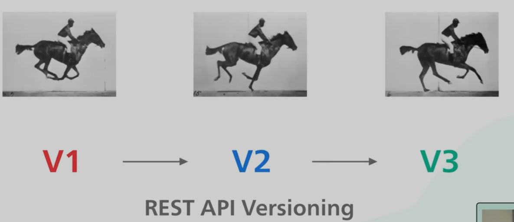

---
references:
  - https://www.youtube.com/watch?v=-mN3VyJuCjM
  - https://www.youtube.com/watch?v=faMdrSCVDzc
---
# RESTful APIs

[Representational State Transfer, or REST,](https://developer.mozilla.org/en-US/docs/Glossary/REST) is a popular convention that HTTP servers follow. Not all HTTP APIs are "REST APIs", or "RESTful", but it is _very_ common.

RESTful servers follow a loose set of rules that makes it easy to build reliable and predictable web APIs. REST is more or less a set of conventions about how HTTP _should_ be used.
## Separate and agnostic

The big idea behind REST is that resources are transferred via well-recognized, language-agnostic client/server interactions. A RESTful style means the implementation of the client and server can be done independently of one another, as long as some simple standards, like the names of the available resources, have been established.

## Stateless

A RESTful architecture is _stateless_, which means the server does not need to know what state the client is in, nor does the client need to know what state the server is in. Statelessness in REST is enforced by interacting with _resources_ instead of _commands_. Keep in mind, this doesn't mean the applications are stateless - on the contrary, what would "updating a resource" even mean if the server wasn't keeping track of its state?

> [!NOTE]
> The two parties in the request do not need to store any information about one another; and every request is independent from one another. This leads to easy scalability.
> 
> Each request made by the client, must contain all necessary information for that particular HTTP method.  

## Paths in REST

In a RESTful API, the last section of the `path` of a URL should specify which resource is being accessed. Then, as we talked about in the "methods" chapter, depending on whether the request is a `GET`, `POST`, `PUT` or `DELETE`, the resource is read, created, updated, or deleted.

The _Fantasy Quest_ API we have been working with is a RESTful API! Take a look at the URLs we've been using:

- `https://api.boot.dev/v1/courses_rest_api/learn-http/locations`
- `https://api.boot.dev/v1/courses_rest_api/learn-http/users`
- `https://api.boot.dev/v1/courses_rest_api/learn-http/items`

The first part of the path specifies the _version_. In this case, version 1, or `v1`.

The second part of the path tells our server that this is a REST API for the "learn http" course.

Finally, the last part denotes which _resource_ is being accessed, be it a `location`, `user`, or `item`.


**Does a backend server need to adhere to RESTful standards?**
- [ ] Yes, otherwise the requests will fail
- [ ] Yes, if it doesn't it's an insecure server
- [ ] No, it's generally a bad idea
- [x] No, but it's a common convention designed to create better APIs

**The `____` part of a URL path typically denotes the resource**
- [ ] Middle
- [x] Last
- [ ] First
# Versioning

Versioning of an API is important as it allows an implementation to allow backwards compatibility.

This means that if we introduce breaking chances to our functionality/server, then consumers will have enough time to transition the code on their clients to the newer versions without any downtime.

There are many ways to version an api, the most common is to prefix the version on the resource on the path of the URI.

```js
/v1/products
/v2/products
```

