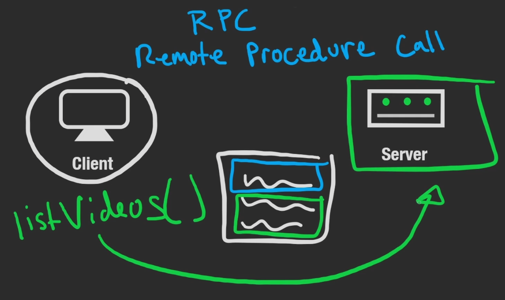

# Remote Procedure Call (RPC)

**BASICALLY EXECUTING CODE THAT'S NOT ON OUR SINGLE LOCAL MACHINE**

We use listVideo's locally and send that request. On the server there's a bunch of stuff happening behind the scenes before it returns a list of videos.

RPC, or Remote Procedure Call, is a protocol that one program can use to request a service from a program located in another computer on a network without having to understand the network's details. 

In other words, it allows a client application to execute a function or method on a server application as if it were a local function call, hiding the complexities of the network layer. This makes distributed development more straightforward by abstracting the networking code.

Here's a simplified flow of how RPC works:

1. The client calls the client stub with the procedure parameters. The call is a local operation.
2. The client stub packs the parameters into a message and makes a system call to send the message. Packing the parameters is called marshalling.
3. The client's OS sends the message from the client machine to the server machine.
4. The server's OS passes the incoming packets to the server stub.
5. The server stub unpacks the parameters from the message. Unpacking the parameters is called unmarshalling.
6. Finally, the server stub calls the server procedure with the unpacked parameters.

The server's response goes through a similar process in reverse.

RPC is used in a variety of applications, including distributed file systems, network management, and web services.